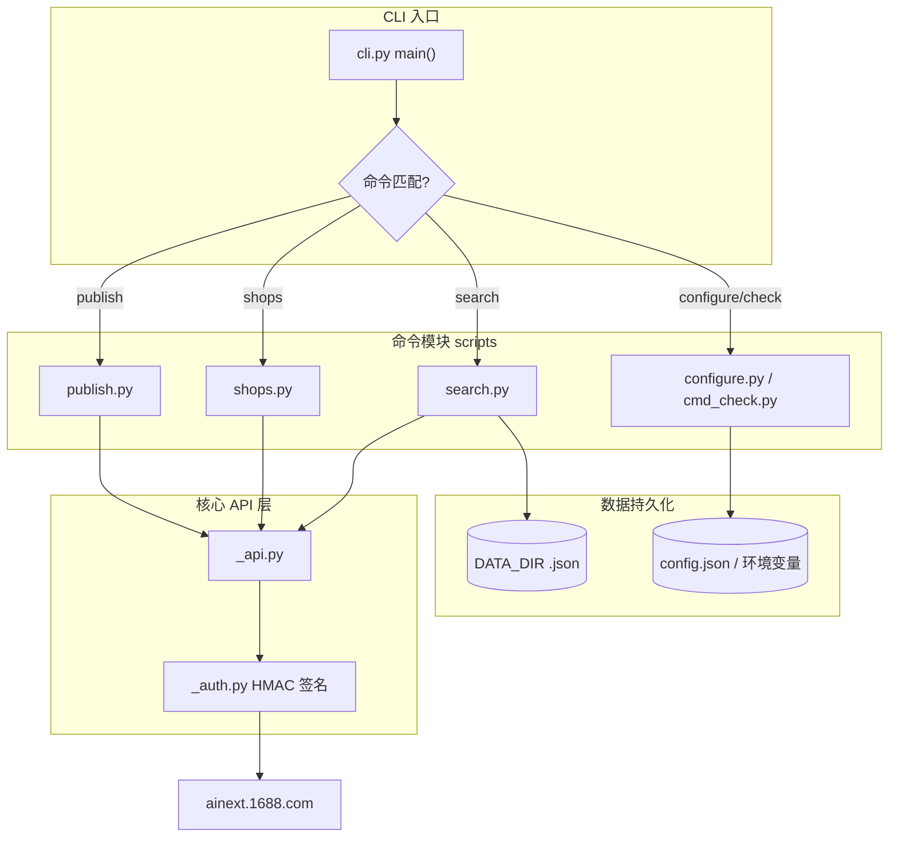
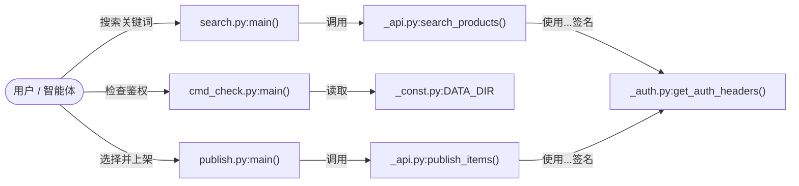
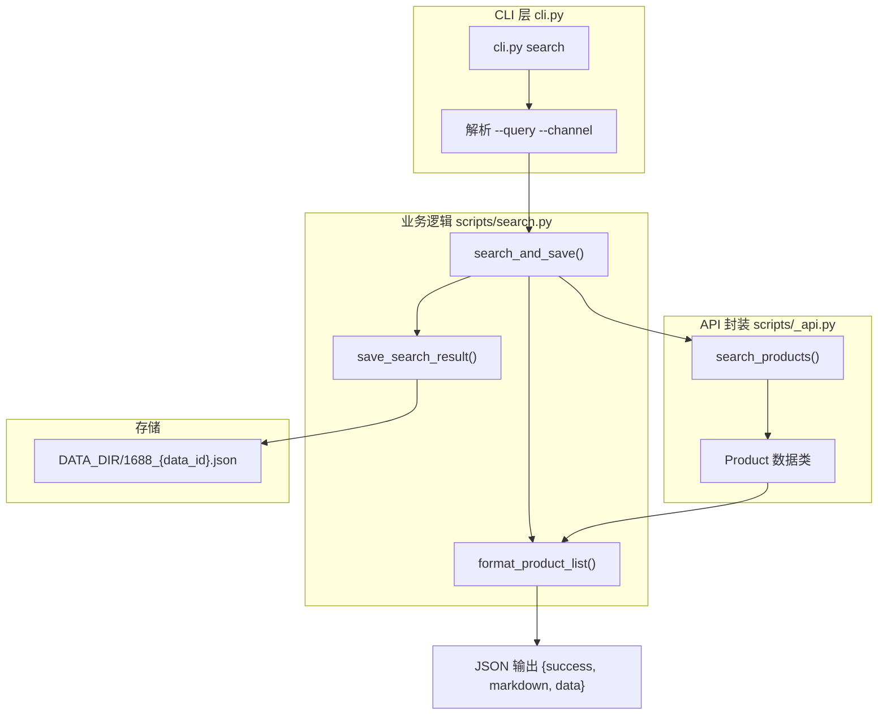
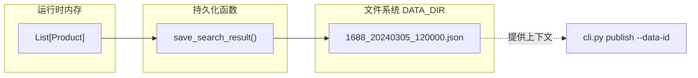
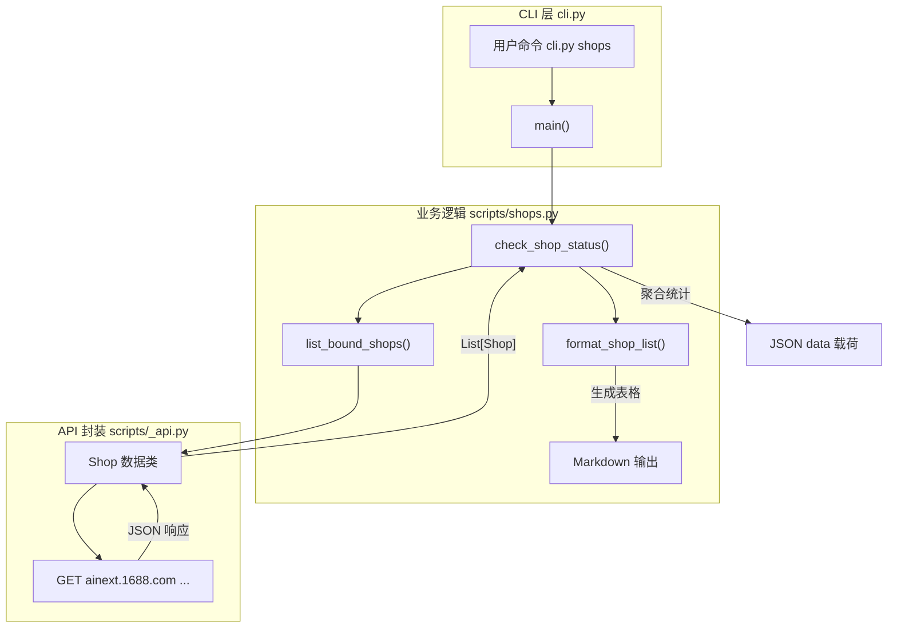
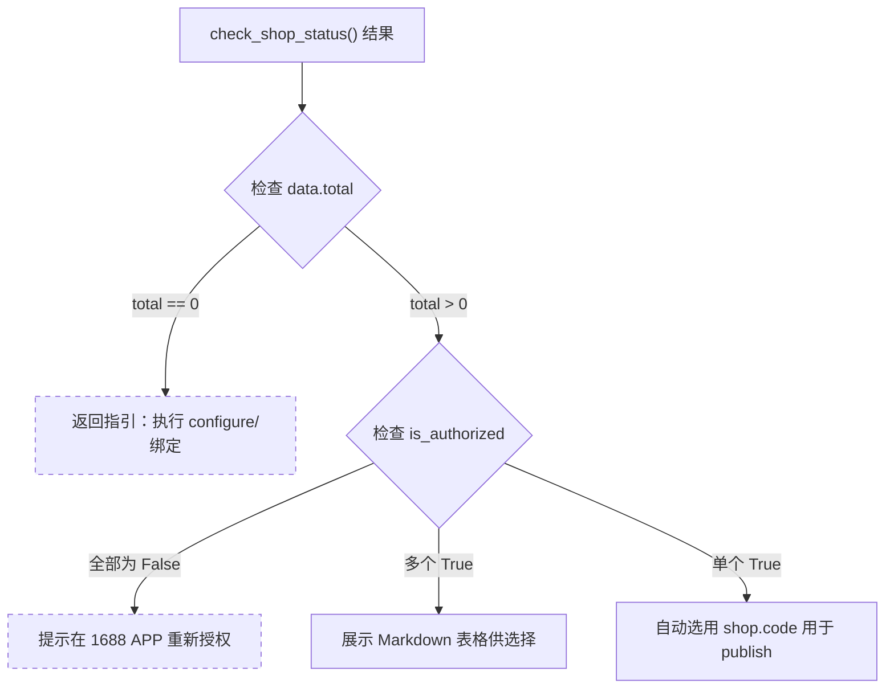
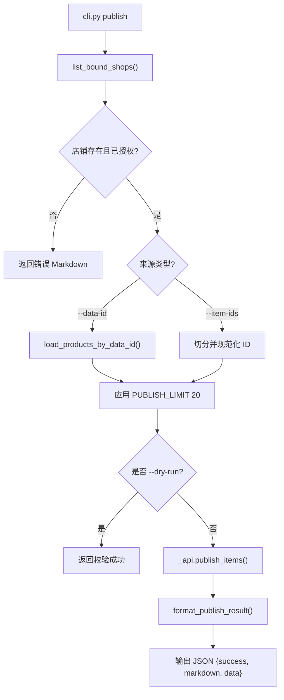
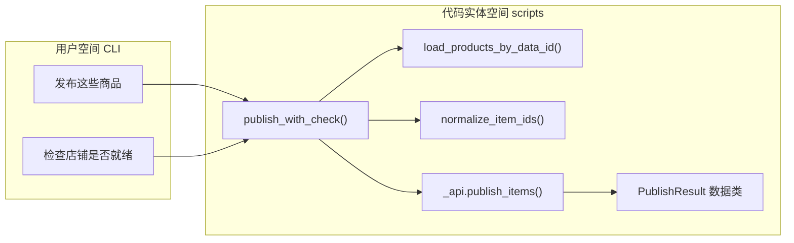
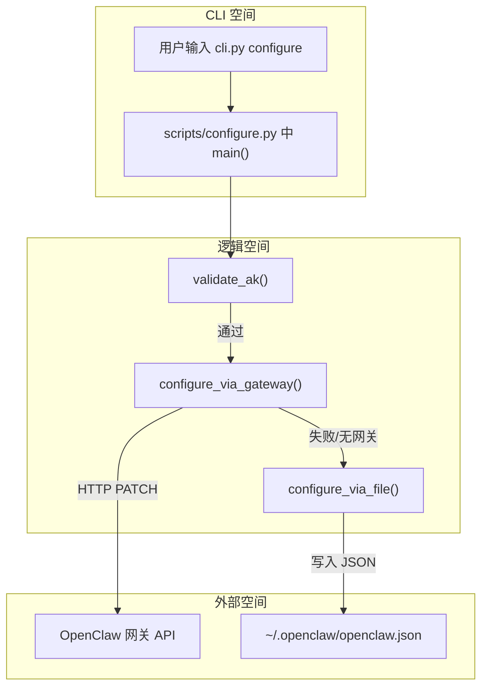
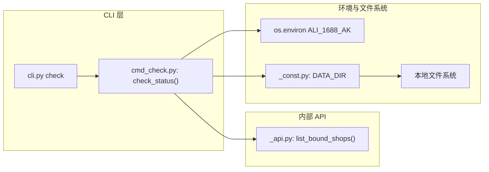

# CLI 参考

<details>
<summary>相关源文件</summary>

以下文件曾作为生成本 wiki 页面的上下文：

- [SKILL.md](../SKILL.md)
- [cli.py](../cli.py)

</details>

`cli.py` 是 **1688-shopkeeper** 工具集的统一入口，通过将用户命令派发到 `scripts/` 下的专用子模块，为选品、店铺管理与分发提供一致接口。

### 统一命令接口

CLI 遵循标准执行模式：`python3 cli.py <command> [options]`。运行时将 `scripts/` 注入系统路径，并动态导入对应命令模块。

#### 命令派发映射

下表将 CLI 命令映射到内部实现模块：

| 命令 | 实现模块 | 主要用途 |
| :--- | :--- | :--- |
| `search` | `search.py` | 查询 1688 商品并持久化结果。 |
| `shops` | `shops.py` | 列出已绑定下游店铺及授权状态。 |
| `publish` | `publish.py` | 将所选商品分发到指定店铺。 |
| `configure` | `configure.py` | 持久化 `ALI_1688_AK` 凭证。 |
| `check` | `cmd_check.py` | 校验 AK、店铺数量与环境。 |

### 标准输出结构

无论内部逻辑如何，所有命令均向 `stdout` 输出统一 JSON，便于自动化智能体与程序调用。

```json
{
  "success": "boolean",
  "markdown": "string（供展示的人类可读输出）",
  "data": "object（结构化结果载荷）"
}
```

`markdown` 字段用于直接展示给用户；`data` 承载原始实体（如商品列表、店铺对象），供 LLM 或脚本继续处理。

### 命令流与关系

CLI 支撑线性的「选品—分发」工作流。下图说明命令如何与代码实体及外部 1688 API 交互。

**CLI 执行流程**



### 系统实体映射

下图将高层用户动作映射到负责逻辑的代码实体。

**动作到实体映射**



---

## search — 商品搜索命令

<details>
<summary>相关源文件</summary>

以下文件曾作为生成本 wiki 页面的上下文：

- [references/search.md](../references/search.md)
- [scripts/search.py](../scripts/search.py)

</details>

`search` 命令是 1688 生态内商品发现的主入口：对接 1688 AI 搜索 API，按自然语言查询拉取商品，做数据规范化，将结果持久化供下游分发使用，并生成人类可读的 Markdown 报告。

### 命令参考

通过统一入口 `cli.py` 调用：

```bash
python3 cli.py search --query "夏季连衣裙" [--channel channel_name]
```

#### 参数

| 参数 | 短选项 | 必填 | 默认值 | 说明 |
| :--- | :--- | :--- | :--- | :--- |
| `--query` | `-q` | 是 | N/A | 商品的自然语言描述。API 支持语义理解（例如「100 元以内的露营椅」）。 |
| `--channel` | `-c` | 否 | `""` | 目标下游平台。可选：`douyin`、`taobao`、`pinduoduo`、`xiaohongshu`。省略时不做渠道专属过滤。 |

---

### 数据流与实现

执行 `cli.py search` 时，请求派发到 `scripts/search.py`，主要分三阶段：**API 拉取**、**持久化**、**格式化**。

#### 搜索执行逻辑

1. **鉴权检查：** 确认环境中存在 `ALI_1688_AK`。  
2. **API 调用：** 调用 `_api` 模块的 `search_products(query, channel)`。  
3. **结果持久化：** 将原始商品数据与元数据写入 `DATA_DIR` 下 JSON 文件。  
4. **Markdown 生成：** 将 `Product` 对象列表转为 GitHub 风格 Markdown 表格。  

#### 代码实体映射

**搜索逻辑流程**



---

### 商品输出结构

命令返回标准 JSON。`data` 字段中的结构化商品信息供智能体深度分析。

#### `Product` 对象

`products` 列表中每一项结构如下：

* **`id`：** 1688 Offer 唯一 ID（如 `"991122553819"`）。  
* **`title`：** 商品标题。  
* **`price`：** 单价（人民币）。  
* **`url`：** 1688 商品详情页直链。  
* **`stats`：** 绩效指标字典。  

#### 指标（`stats`）参考

| 字段 | 含义 | 用途 |
| :--- | :--- | :--- |
| `last30DaysSales` | 近 30 天销量 | 主要体量指标 |
| `goodRates` | 好评率（0.0～1.0） | 质量指标 |
| `repurchaseRate` | 复购率（0.0～1.0） | 用户满意度 |
| `downstreamOffer` | 目标平台已有上架数 | 竞争度（市场饱和度） |
| `collectionRate24h` | 24 小时揽收率 | 物流可靠性 |
| `last30DaysDropShippingSales` | 一件代发相关销量 | B2B 需求指标 |

---

### 结果持久化（`data_id`）

每次成功搜索会基于当前时间戳生成 `data_id`（格式 `YYYYMMDD_HHMMSS`）。

1. **文件路径：** 结果写入 `{DATA_DIR}/1688_{data_id}.json`。  
2. **内容：** 保存原始查询、渠道、时间戳，以及商品 ID 到完整元数据（含 `stats`）的映射。  
3. **用途：** `publish` 命令需要该 `data_id` 以定位要分发的搜索批次。  

**数据持久化架构**



---

### Markdown 格式化

输出中的 `markdown` 字段已预格式化，展示前 20 个商品的表格。

* **比率转换：** 小数值（如 `0.857`）转为百分比（`85.7%`）。  
* **转义：** 标题中的竖线（`|`）转义，避免破坏 Markdown 表格。  
* **截断：** 若商品超过 20 个，页脚提示完整数据见 JSON `data`。  

---

## shops — 店铺管理命令

<details>
<summary>相关源文件</summary>

以下文件曾作为生成本 wiki 页面的上下文：

- [references/publish.md](../references/publish.md)
- [scripts/shops.py](../scripts/shops.py)

</details>

`shops` 命令是 `1688-skill` CLI 的核心工具，用于获取并管理绑定在用户 1688 账号下的零售店铺集合，也是获取 `publish` 所需 `shop_code` 的主要途径。

### 1. 功能概览

`shops` 实时查询 1688 AI Next API，拉取已绑定店铺（抖音、拼多多、小红书、淘宝等），校验各店授权状态，并结构化汇总有效与过期凭证。

#### 关键能力：

* **发现：** 列出当前 1688 账号下所有已关联店铺。  
* **校验：** 识别 OAuth 令牌仍有效（`✅ 正常`）或需重新授权（`⚠️ 授权过期`）的店铺。  
* **数据提取：** 提供分发所需的唯一 `shop_code`。  
* **状态摘要：** 计算 `valid_count`、`expired_count` 便于快速健康度判断。  

---

### 2. 实现逻辑

命令实现在 `scripts/shops.py`，由主入口 `cli.py` 派发，依赖 `_api.list_bound_shops` 与上游 1688 网关通信。

#### 数据流示意图



---

### 3. 数据模型

#### Shop 对象

店铺的内部表示使用 `_api.py` 中定义的 `Shop` 数据类。

| 字段 | 类型 | 说明 |
| :--- | :--- | :--- |
| `code` | `str` | 店铺唯一标识（如 `"260391138"`） |
| `name` | `str` | 店铺展示名称 |
| `channel` | `str` | 平台标识（如 `douyin`、`pinduoduo`） |
| `is_authorized` | `bool` | 1688 与店铺授权当前是否有效 |

#### CLI 输出结构

命令返回标准 JSON：

```json
{
  "success": true,
  "markdown": "带状态图标的 Markdown 表格...",
  "data": {
    "total": 2,
    "valid_count": 1,
    "expired_count": 1,
    "shops": [
      {
        "code": "260391138",
        "name": "我的抖音店铺",
        "channel": "douyin",
        "is_authorized": true
      }
    ]
  }
}
```

---

### 4. 店铺选择逻辑

与 LLM 或智能体集成时，可依据 `shops` 输出采用下列启发式决定 `publish` 的下一步：

#### 选择启发式映射



---

### 5. 错误处理与约束

#### 常见失败状态

1. **缺少 AK：** 环境未设置 `ALI_1688_AK` 时返回 `success: false`，提示执行 `configure`。  
2. **网络/API 错误：** 通过 `_api.py` 的 `with_retry` 重试；3 次均失败则返回描述性错误信息。  
3. **授权过期：** API 调用可能成功，但个别店铺 `is_authorized: false`，在 Markdown 中以 `⚠️ 授权过期` 展示。  

#### 约束

* **平台支持：** 仅 `_const.CHANNEL_MAP` 映射内的平台店铺可被可靠处理。  
* **格式化：** 店铺名与渠道名中的管道符 `|` 替换为 `\|`，避免 Markdown 表格断裂。  

---

## publish — 商品分发命令

<details>
<summary>相关源文件</summary>

以下文件曾作为生成本 wiki 页面的上下文：

- [references/publish.md](../references/publish.md)
- [scripts/publish.py](../scripts/publish.py)

</details>

`publish` 命令是 1688-shopkeeper 工作流的最后一步：将 1688.com 上的所选商品分发到下游零售店铺（抖音、拼多多等）。负责起飞前店铺校验、从历史搜索解析商品 ID，并对接 1688 AI 分销 API。

### 1. 命令概览

通过 `cli.py publish` 调用，须提供目标店铺编码与商品 ID 来源。单批处理数量受上游 API 严格限制。

#### 1.1 参数参考

| 参数 | 要求 | 说明 |
| :--- | :--- | :--- |
| `--shop-code` | **必填** | 目标店铺唯一标识，由 `shops` 命令获得。 |
| `--data-id` | 可选* | 某次搜索返回的基于时间戳的 ID，从 `DATA_DIR` 对应 JSON 加载全部商品。 |
| `--item-ids` | 可选* | 逗号分隔的 1688 商品 ID 列表。 |
| `--dry-run` | 可选 | 仅做店铺与授权校验，不调用实际分发 API。 |

*\*注：`--data-id` 与 `--item-ids` 互斥。*

#### 1.2 运行约束

- **批量上限：** 单次最多发布 20 条；若超出，仅处理前 20 条。  
- **授权：** 目标店铺须为有效授权（`is_authorized: true`）；令牌过期则起飞前检查失败。  

---

### 2. 技术实现

分发逻辑遵循「检查—解析—执行」流水线。

#### 2.1 逻辑流程图

**发布执行流程**



#### 2.2 数据解析

使用 `--data-id` 时，系统在 `DATA_DIR` 中查找 `1688_{data_id}.json`。

- 支持字典结构（key 为商品 ID）与列表结构。  
- ID 会去重、去空串，并尽量保持原有顺序。  

#### 2.3 衔接：自然语言到代码实体

**实体映射图**



---

### 3. 数据结构及结果

命令返回标准 JSON，含用于展示的 `markdown` 与用于程序解析的 `data`。

#### 3.1 PublishResult 结构

内部 `PublishResult` 数据类记录 API 调用的细粒度结果。

| 字段 | 类型 | 说明 |
| :--- | :--- | :--- |
| `success` | bool | API 事务整体是否成功。 |
| `published_count`| int | 成功上架条数。 |
| `submitted_count`| int | 请求中发送的总条数。 |
| `fail_count` | int | 上架失败条数。 |
| `failed_items` | list | 含各失败商品错误详情的字典列表。 |

#### 3.2 Markdown 报告逻辑

`format_publish_result` 生成可视化报告。

1. **标题：** 显示目标店铺名称。  
2. **状态图标：** 成功用 ✅，失败用 ❌。  
3. **警告：** 若超过 `PUBLISH_LIMIT` 20 条，明确提示仅处理了子集。  
4. **错误详情：** 失败时列出 1688 网关返回的具体错误信息（项目符号列表）。  

---

### 4. 错误处理与起飞前检查

`publish` 在消耗 API 配额前执行多项安全检查：

1. **店铺存在性：** 校验 `--shop-code` 与当前账号已绑定店铺一致。  
2. **授权状态：** 检查 `target_shop.is_authorized`；若为 `False`，提供 1688 AI 版 App 深度链接以便重新授权。  
3. **渠道映射：** 确保店铺平台（如 `douyin`）经 `CHANNEL_MAP` 映射为有效内部渠道 ID。  
4. **数据持久化：** `--data-id` 缺失或文件损坏时，以 `success: false` 的 JSON 退出。  

---

## configure 与 check — 配置类命令

<details>
<summary>相关源文件</summary>

以下文件曾作为生成本 wiki 页面的上下文：

- [references/configure.md](../references/configure.md)
- [scripts/cmd_check.py](../scripts/cmd_check.py)
- [scripts/configure.py](../scripts/configure.py)

</details>

`configure` 与 `check` 构成 1688-shopkeeper 技能的基础设置与校验层：负责 **访问密钥（AK）**（与 1688 AI 平台交互的主凭证）的持久化，并对环境做健康检查，包括店铺授权状态与文件系统权限。

### AK 持久化策略

技能采用双层持久化，在写入 AK 的同时避免破坏 OpenClaw 配置环境。

#### 1. 网关 API（首选）

`configure_via_gateway` 尝试通过 OpenClaw 网关 REST API 写入 AK。首选原因是可编程更新配置，避免直接改文件导致 `openclaw.json` 的 JSON5 格式或注释损坏。目标为 `1688-shopkeeper` 技能条目中的环境变量 `ALI_1688_AK`。

#### 2. 文件回退（次选）

网关不可用时，`configure_via_file` 尝试直接写入 `~/.openclaw/openclaw.json`，并在更新前校验文件为合法 JSON。

#### 配置数据流

**标题：AK 配置与持久化流程**



---

### 命令参考：`configure`

用于设置或查看当前 Access Key。

#### AK 校验规则

持久化前按以下条件校验 AK：

* **长度：** 至少 32 个字符。  
* **字符：** 仅允许 `A-Z`、`a-z`、`0-9`、`_`、`-`、`=`。  
* **结构：** 前 32 字节为 Secret，其余为 Key ID。  

#### 用法

| 模式 | 命令 | 输出 |
| :--- | :--- | :--- |
| **写入 AK** | `python3 cli.py configure YOUR_AK` | 带脱敏的 JSON 确认 |
| **查看状态** | `python3 cli.py configure` | 当前配置来源与脱敏 AK |

#### 实现要点

* **来源检测：** `check_existing_config` 判断 AK 来自环境变量（已生效）还是配置文件（待重启网关）。  
* **即时使用：** 基于文件的配置常需重启网关后全局生效，CLI 建议在后续命令前加前缀 `ALI_1688_AK=...` 以立即生效。  

---

### 命令参考：`check`

`check` 做系统级健康检查，安装后建议首先执行以确认环境。

#### 健康检查组成

`check_status` 评估三个关键方面：

1. **AK 配置：** 环境中是否存在 `ALI_1688_AK`。  
2. **店铺绑定：** 若 AK 有效，调用 `_api.py` 的 `list_bound_shops` 统计店铺总数与过期授权数。  
3. **数据目录：** 验证 `_const.py` 定义的 `DATA_DIR` 存在且可写。  

#### `check_status` 数据载荷

命令返回 JSON，其中 `data` 块供程序消费：

| 字段 | 类型 | 说明 |
| :--- | :--- | :--- |
| `ak_configured` | boolean | 环境中是否找到 AK。 |
| `shops_count` | integer | 1688 账号下绑定店铺总数。 |
| `expired_count` | integer | 需要重新授权的店铺数。 |

#### 系统集成示意图

**标题：check 命令系统集成**



#### 用法

```bash
python3 cli.py check
```
