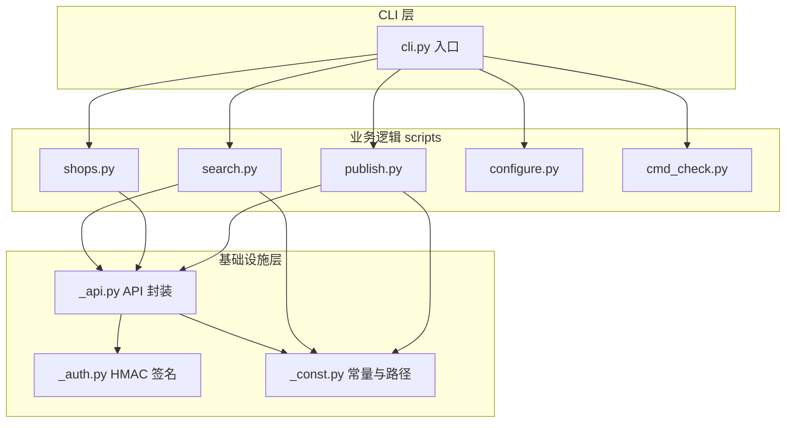
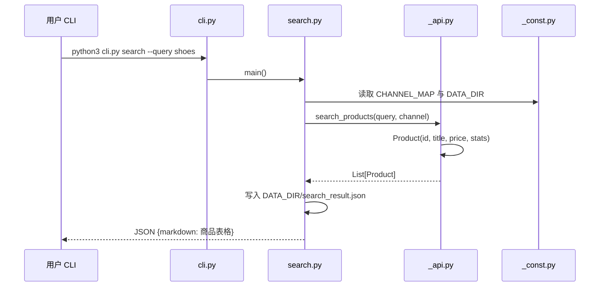
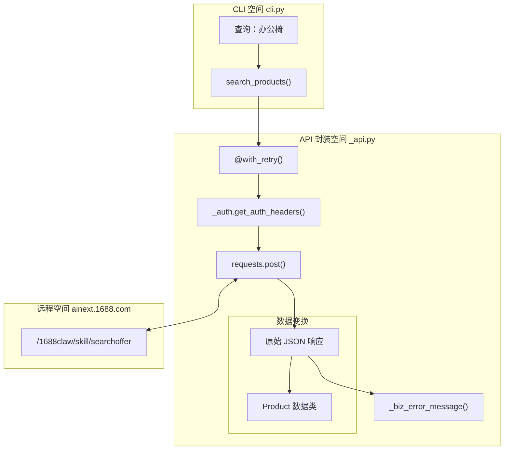
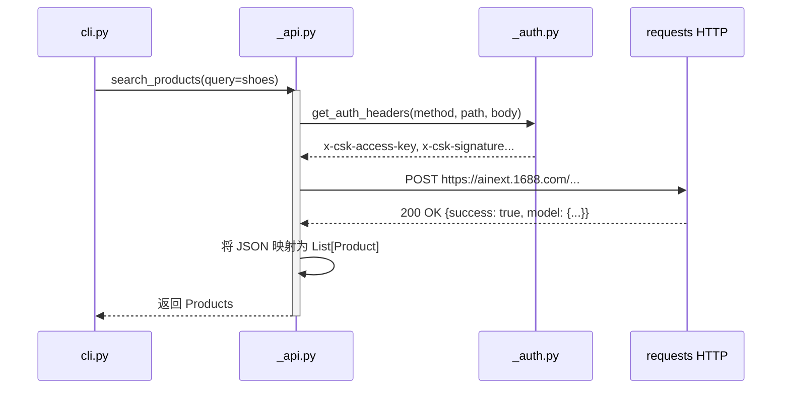
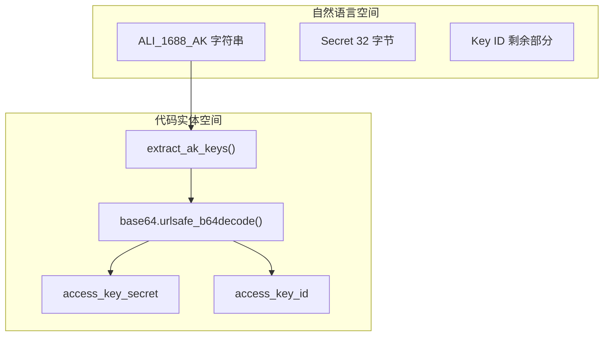
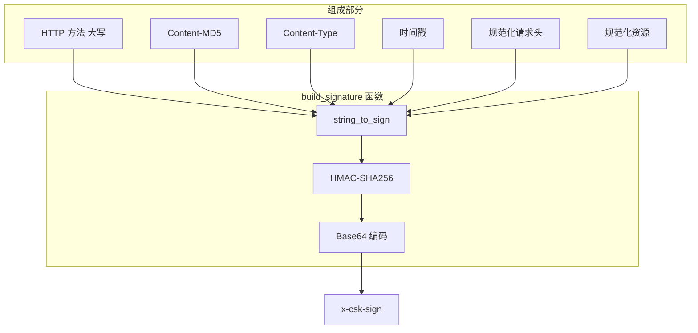
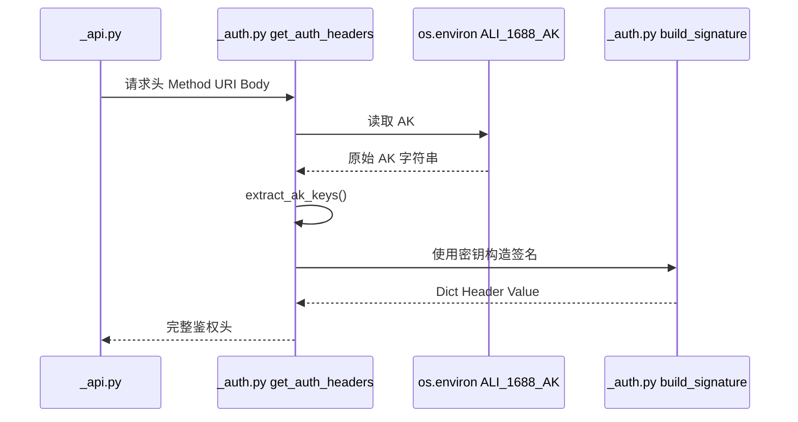
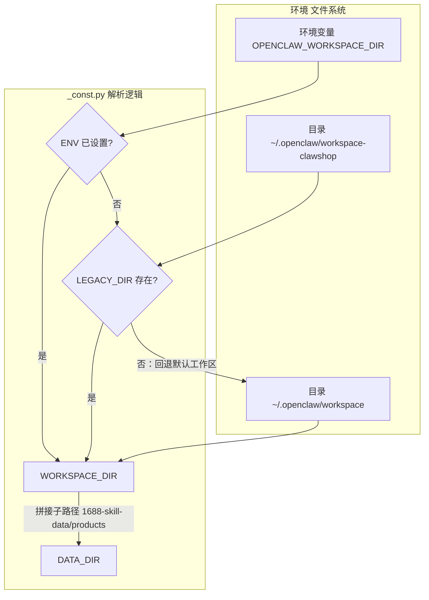

# 核心架构

相关源文件

以下文件曾作为生成本 wiki 页面的上下文：

- [cli.py](../cli.py)
- [scripts/_api.py](../scripts/_api.py)
- [scripts/_const.py](../scripts/_const.py)

1688-shopkeeper 代码库采用模块化 CLI 应用结构，分层设计将用户界面（CLI）、业务逻辑（命令模块）与基础设施（API 通信与鉴权）分离。

## 系统设计总览

架构承担从自然语言查询到结构化 API 请求的整条链路。入口 `cli.py` 作为调度器，将任务委派给具体命令脚本，并共享鉴权与配置等公共能力。

### 模块关系示意图

下图说明各代码实体如何衔接用户命令与 1688 AI API。

---

## 分层架构

### 1. CLI 入口

`cli.py` 作为统一界面，使用映射字典 `COMMANDS` 将执行派发到 `scripts/` 下对应子模块，并保证各命令返回标准化的 JSON（含 `success`、`markdown`、`data`）。

### 2. 命令派发（scripts/）

每个命令（如 `search`、`publish`）为独立模块，负责：

* 解析该命令专有参数；
* 调用 `_api.py` 中的高层函数；
* 将原始数据格式化为 Markdown 表格供展示；
* 将搜索结果持久化到 `DATA_DIR`。

### 3. API 封装（`_api.py`）

该层屏蔽 HTTP 细节，提供三类原子能力：`search_products`、`list_bound_shops`、`publish_items`。使用 `with_retry` 装饰器处理瞬时网络故障，并将 HTTP 与业务层错误统一为可读信息。

### 4. 鉴权（`_auth.py`）

鉴权模块实现 `ainext.1688.com` 网关要求的 `HMAC-SHA256` 签名：解析环境变量 `ALI_1688_AK` 得到 Secret 与 Key ID，并构造规范请求头（如 `x-csk-nonce`、`x-csk-signature`）。

### 5. 常量与数据目录（`_const.py`）

集中全局配置，避免魔法字符串。定义 `CHANNEL_MAP`（将「抖店」等别名映射为 `douyin` 等 API 值），并基于环境变量 `OPENCLAW_WORKSPACE_DIR` 解析 `DATA_DIR` 路径。

---

## 数据流与实体映射

下图将内部代码实体（类与常量）映射到典型「搜索—发布」操作的数据流。

### 核心数据结构

| 实体 | 位置 | 用途 |
| :--- | :--- | :--- |
| `Product` | `_api.py` | 1688 商品数据类，含选品用 `stats`。 |
| `Shop` | `_api.py` | 表示已绑定下游店铺及其授权状态。 |
| `PublishResult` | `_api.py` | 一次分发任务的成功/失败汇总。 |
| `CHANNEL_MAP` | `_const.py` | 平台别名字典（如「淘宝」→ `thyny`）。 |

---

## API 封装（_api.py）

相关源文件

以下文件曾作为生成本 wiki 页面的上下文：

- [scripts/_api.py](../scripts/_api.py)

`_api.py` 是 1688-shopkeeper 技能与 **ainext.1688.com** 之间的底层通信层，封装 HTTP 签名、重试与错误归一化，并向系统其余部分提供三类原子能力：商品搜索、店铺列表、商品发布。

### 数据模型（数据类）

模块使用结构化 `dataclasses` 保证类型安全与数据流一致。

| 类 | 用途 | 主要字段 |
|:---|:---|:---|
| `Product` | 单条 1688 商品 offer。 | `id`, `title`, `price`, `image`, `url`, `stats` |
| `Shop` | 已绑定下游商家店铺。 | `code`, `name`, `channel`, `is_authorized` |
| `PublishResult` | 分发任务结果摘要。 | `success`, `published_count`, `failed_items` |

---

### 核心逻辑与流程

下图说明 CLI 的自然语言查询如何转为结构化 API 调用，再映射回 Python 实体。

**示意图：自然语言到代码实体映射**

---

### 实现细节

#### 1. `with_retry` 与可靠性

模块通过 **指数退避** 实现 `with_retry` 装饰器，主要针对 `ConnectionError` 与 `Timeout`（跨境或高延迟网络常见）。

*   **最大重试：** 3 次  
*   **退避：** `min(RETRY_DELAY_BASE * (2 ** attempt), 10)`  
*   **范围：** 仅重试网络级失败；业务错误（如 401）立即透出，避免无效凭证死循环。  

#### 2. 错误归一化

两层错误处理：

*   **HTTP 层（`_http_error_message`）：** 将 401、429、400 等映射为可读中文说明。  
*   **业务层（`_biz_error_message`）：** HTTP 200 但 body 中 `success: false` 时，解析 `msgCode`、`msgInfo` 识别限流或令牌过期等。  

#### 3. 公开函数

**`search_products(query, channel)`**

* 使用 `CHANNEL_MAP` 解析渠道别名。  
* 向 `/1688claw/skill/searchoffer` 发送 POST。  
* 用 `SEARCH_LIMIT` 限制返回量，避免过量处理。  

**`list_bound_shops()`**

* 请求 `/1688claw/skill/searchshop`。  
* 根据远端响应中的 `toolExpired` 与 `shopExpired` 计算 `is_authorized`。  

**`publish_items(shop_code, item_ids)`**

* 通过 `/1688claw/skill/publishitem` 执行分发。  
* 返回 `PublishResult`，含 `failed_items` 列表供 CLI 细粒度报错。  

---

### 系统集成

下图说明 `_api.py` 如何作为业务逻辑与鉴权/网络层之间的网关。

**示意图：内部组件交互**

### 涉及的主要常量

*   **`BASE_URL`：** `https://ainext.1688.com`  
*   **`SEARCH_LIMIT`：** 从 `_const.py` 导入，用于截断结果。  
*   **`PUBLISH_LIMIT`：** 从 `_const.py` 导入，用于校验批量大小。  

---

## 鉴权模块（_auth.py）

相关源文件

以下文件曾作为生成本 wiki 页面的上下文：

- [scripts/_auth.py](../scripts/_auth.py)

`_auth.py` 负责 1688-skill 客户端与后端 API 之间的安全通信：实现自定义 HMAC-SHA256 签名、解析 `ALI_1688_AK` 凭证，并通过 URI 与请求头的规范化保证签名一致。

### 凭证解析（AK）

鉴权从通常保存在环境变量或配置文件中的 `ALI_1688_AK` 开始。该字符串为组合凭证，需拆分为 `AccessKeyID` 与 `AccessKeySecret`。

函数 `extract_ak_keys` 完成拆分：

1. **Base64 解码：** 尝试用 `base64.urlsafe_b64decode` 解码原始输入。  
2. **密钥切分：** 结果字符串的前 32 个字符作为 `access_key_secret`。  
3. **ID 提取：** 从第 32 个字符起的剩余部分作为 `access_key_id`。  

**数据流：AK 提取**

---

### 规范化流程

为使签名在经过各类网络中间件后仍有效，模块在签名前对 URI 与自定义请求头做规范化。

#### 1. 规范化资源（Canonicalized Resource）

`get_canonicalized_resource` 标准化请求 URI：

* 将 URI 解析为 path 与 query；  
* 按 key 字母序排列查询参数；  
* 对 key 与 value 使用 `quote(key, safe='')` 做 URL 编码以保持一致。  

#### 2. 规范化请求头

使用前缀为 `x-csk-` 的自定义头：按 key 名排序，格式为每行 `lowercase_key:stripped_value\n`。

**逻辑流：待签名字符串构造**

---

### 请求签名实现

核心逻辑在 `build_signature`，生成授权请求所需的最终 HTTP 头。

#### 安全头（`x-csk-*`）

模块向每个已签名请求注入：

| 头 | 说明 | 来源 |
| :--- | :--- | :--- |
| `x-csk-ak` | Access Key ID | `ak_id` |
| `x-csk-time` | 当前 Unix 时间戳 | `int(time.time())` |
| `x-csk-nonce` | 8 位十六进制随机串 | `uuid.uuid4().hex[:8]` |
| `x-csk-content-md5` | 请求体 MD5 的 Base64 | `get_content_md5(body)` |
| `x-csk-version` | 当前技能版本 | `SKILL_VERSION` |
| `x-csk-sign` | HMAC-SHA256 签名 | 由 `ak_secret` 计算 |

#### 签名计算

以 `access_key_secret` 为密钥、`string_to_sign` 为消息执行 `HMAC-SHA256`，摘要做 Base64 编码。

---

### 便捷接口

模块提供 `get_auth_headers` 作为其他模块（如 `_api.py`）的主要入口。

**函数：`get_auth_headers(method, uri, body)`**

1. 调用 `get_ak_from_env()` 读取凭证。  
2. 若缺失则返回 `None`，由调用方处理未授权。  
3. 以默认 `content_type` 为 `application/json` 调用 `build_signature`。  

**鉴权数据流**

---

## 常量与数据目录（_const.py）

相关源文件

以下文件曾作为生成本 wiki 页面的上下文：

- [scripts/_const.py](../scripts/_const.py)

`_const.py` 是 `1688-shopkeeper` 技能的单一配置源，集中业务限制与环境相关的路径解析，保证 CLI、API 封装与数据持久化一致。

### 目的与集中管理

将常量集中可避免魔法数字与重复字符串；其他模块应从本文件导入全局值，而非本地重复定义。

#### 主要常量

| 常量 | 值 | 说明 |
| :--- | :--- | :--- |
| `SKILL_VERSION` | `"1.0.0"` | 技能当前版本。 |
| `DEFAULT_CHANNEL` | `"douyin"` | 未指定渠道时的默认平台。 |
| `SEARCH_LIMIT` | `20` | 搜索 API 返回商品数上限。 |
| `PUBLISH_LIMIT` | `20` | 单次批量发布请求允许的最大条数。 |

### 渠道映射逻辑

`CHANNEL_MAP` 在用户输入（自然语言或 CLI 参数）与后端 API 要求之间提供解析层。

#### 映射模式

映射支持三类键：

1. **标准英文名：** CLI 参数直通（如 `pinduoduo`）。  
2. **API 别名：** 常见词映射到后端专用标识（如 `taobao` → `thyny`）。  
3. **中文自然语言：** 中文词映射到 API 值（如 `抖音` → `douyin`）。  

### 数据目录解析（`DATA_DIR`）

`DATA_DIR` 在导入时按以下优先级动态解析：

1. **环境变量：** 若设置了 `OPENCLAW_WORKSPACE_DIR`。  
2. **遗留目录：** 若存在 `~/.openclaw/workspace-clawshop`。  
3. **默认路径：** 回退到 `~/.openclaw/workspace`。  

#### 目录结构

最终 `DATA_DIR` 在解析出的工作区下追加子路径：  
`{WORKSPACE_DIR}/1688-skill-data/products`。

**示意图：工作区与数据目录解析**

