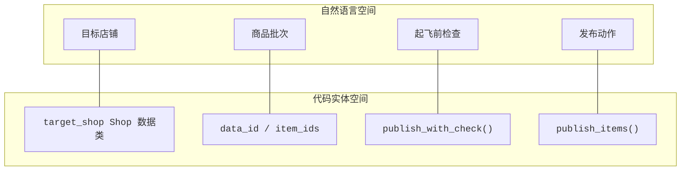
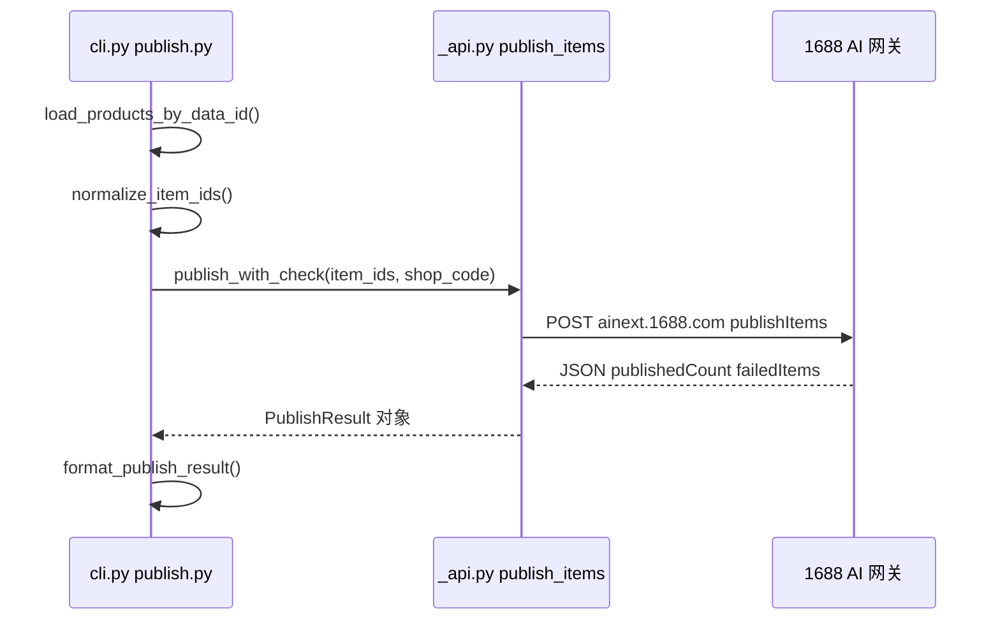
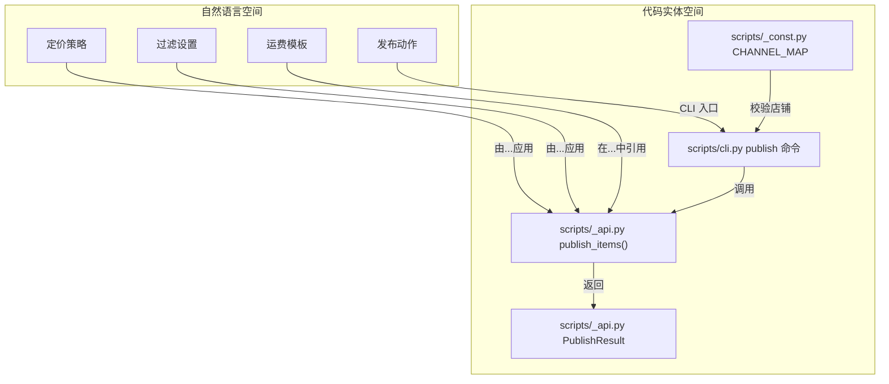
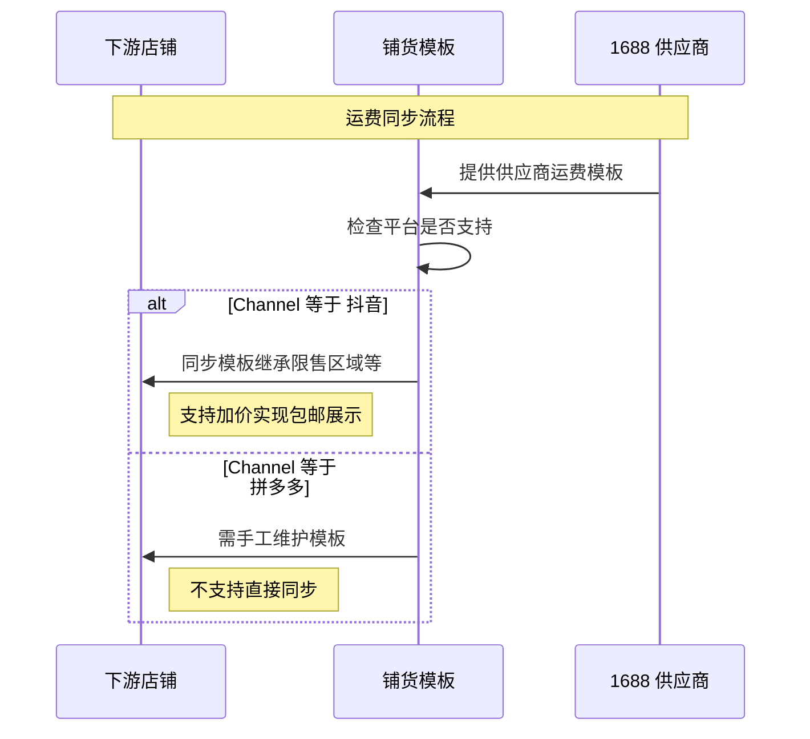
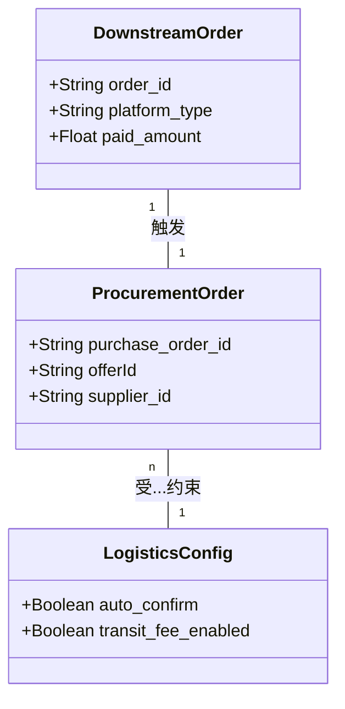
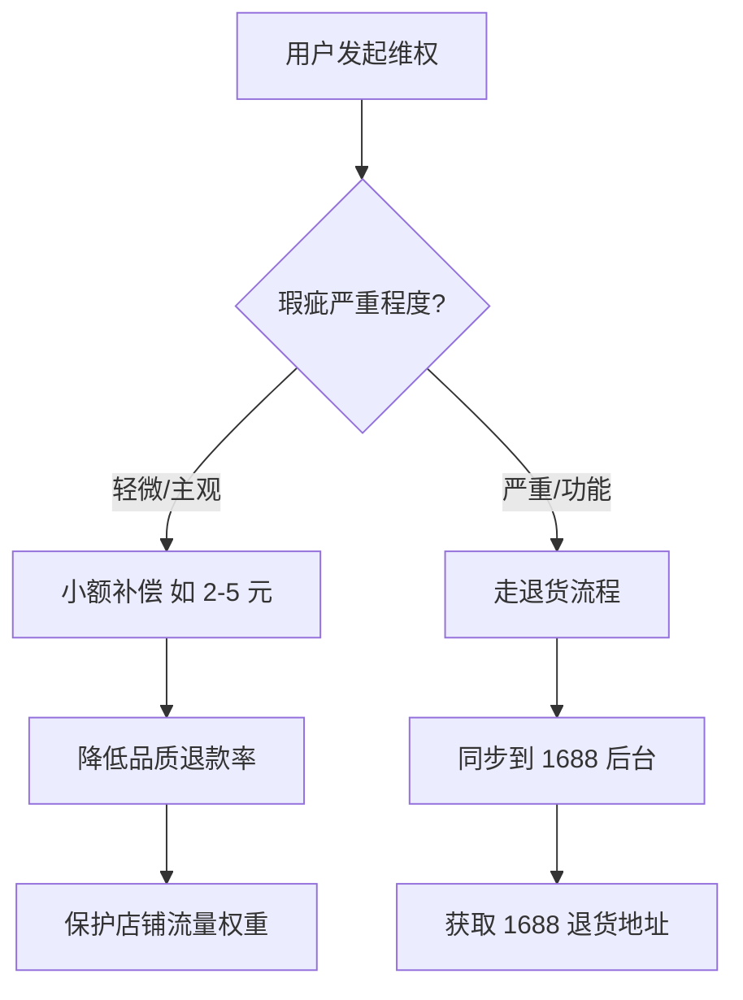
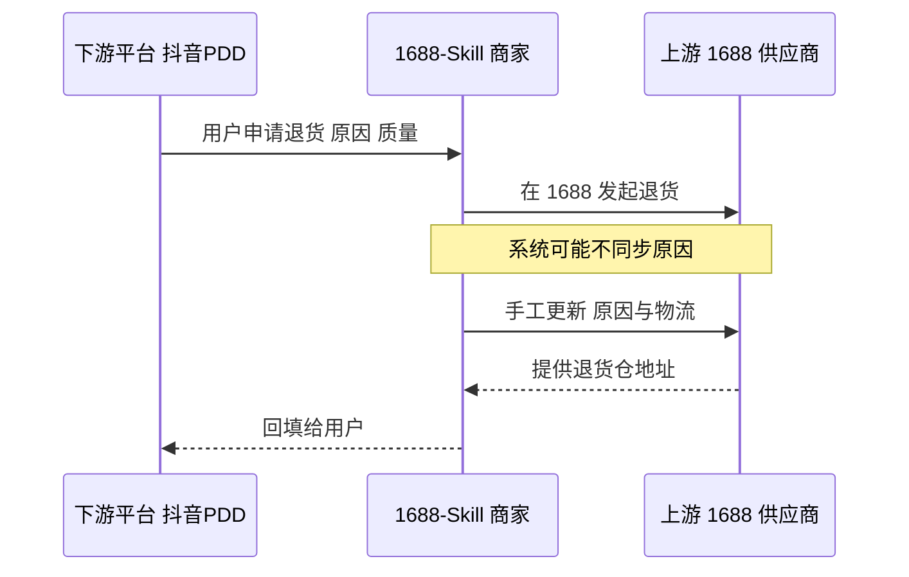
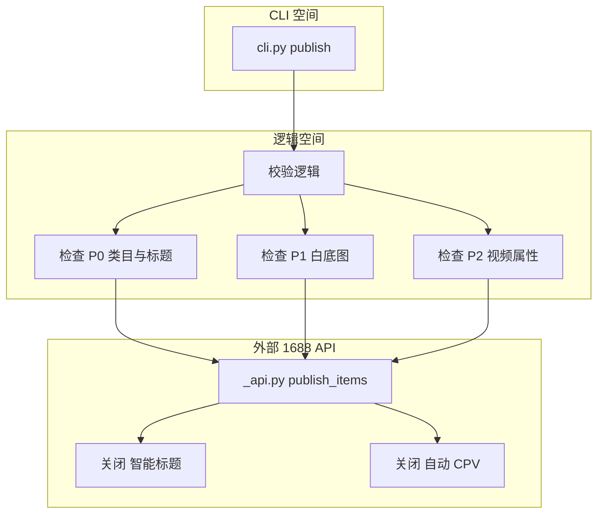
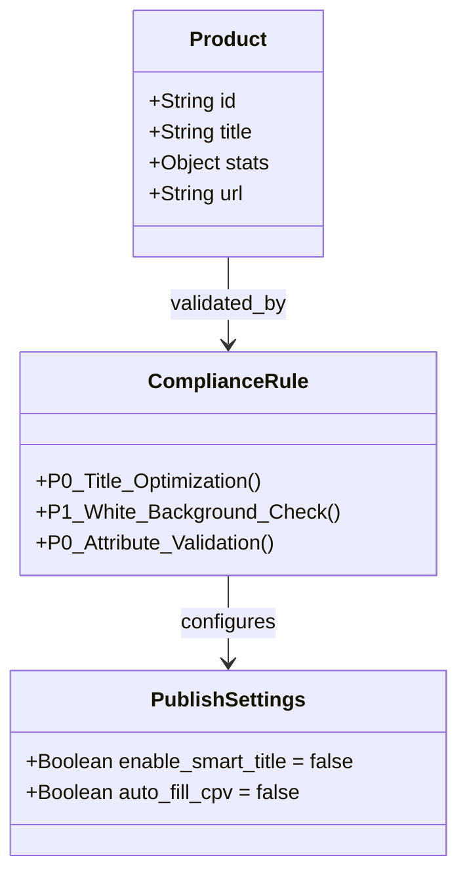

# 分销（铺货）运营指南

相关源文件

以下文件曾作为生成本 wiki 页面的上下文：

- [references/FAQ.md](../references/FAQ.md)
- [references/publish.md](../references/publish.md)
- [scripts/publish.py](../scripts/publish.py)
- [references/faq/listing-template.md](../references/faq/listing-template.md)
- [references/faq/fulfillment.md](../references/faq/fulfillment.md)
- [references/faq/after-sales.md](../references/faq/after-sales.md)
- [references/faq/content-compliance.md](../references/faq/content-compliance.md)

本指南概述分销（铺货）工作流：将 1688 选中的商品自动上架到抖音、拼多多、小红书、淘宝等下游零售店铺，涵盖店铺校验、批量提交与结果解读。

### 流程总览

分销连接「已通过 `search` 识别的机会」与「店铺中的在售链接」，技术上分三阶段：**校验**、**提交**、**解读结果**。

#### 1. 店铺校验

提交商品前，系统确认目标店铺已正确绑定且授权令牌仍有效。由 `scripts/publish.py` 的 `publish_with_check` 处理，内部调用 API 封装中的 `list_bound_shops`。

#### 2. 提交逻辑

用户可通过某次搜索的 `data_id` 引用商品，或直接提供 `item_ids`。系统按 `PUBLISH_LIMIT` **硬性限制每批最多 20 条**。

#### 3. 结果解读

API 返回 `PublishResult` 数据类，再格式化为易读的 Markdown 报告，包含成功数、失败原因与后续建议。

### 技术映射：自然语言到代码实体

下图说明分销概念如何映射到代码库中的 Python 函数与数据结构。

**分销实体映射**

### 分销流水线

流水线保证数据从本地缓存（`data_id` 查询）或用户输入流向 1688 AI 网关。

**发布执行流程**

### 关键分销约束

| 约束 | 取值 / 行为 | 代码参考 |
| :--- | :--- | :--- |
| **批量上限** | 单次请求最多 20 条 | `scripts/_const.py` |
| **店铺授权** | 须 `is_authorized == True` | `scripts/publish.py` |
| **数据来源** | `--data-id` 与 `--item-ids` 互斥 | `scripts/publish.py` |
| **预演** | 校验店铺/商品但不调用发布 API | `scripts/publish.py` |

---

## 上架模板与定价

相关源文件

以下文件曾作为生成本 wiki 页面的上下文：

- [references/faq/listing-template.md](../references/faq/listing-template.md)

本节说明铺货模板与定价策略的配置逻辑与业务规则。`cli.py` 与 `_api.py` 负责发布命令的技术执行，但铺货成败仍依赖 1688 商家后台中的模板设置——它决定数据在到达抖音、拼多多、小红书等平台前如何被转换。

### 分销逻辑总览

分销将 1688 源商品数据映射到下游店铺 schema。该变换由「铺货模板」控制。系统通过 `scripts/_api.py` 的 `publish_items` 触发传输，而定价与过滤规则由目标店铺所关联模板定义。

### 系统映射：逻辑到代码

**分销实体映射**

---

### 定价倍数与策略

不同渠道的佣金、流量成本与营销习惯差异大，定价逻辑需区分渠道。建议以含运费的 **代发价** 作为基准参考价。

#### 分渠道倍数

| 平台 | 倍数 | 策略说明 |
| :--- | :--- | :--- |
| **抖音（抖店）** | 2.0x | 按成本 200% 标价；叠加平台营销优惠后，实际成交价约落在 130%（1.3x）。 |
| **小红书** | 2.0x | 与抖音类似；较高标价以覆盖达人佣金与平台券。 |
| **拼多多** | 1.08x | 模板上限多为 1.08x；进一步调价需在拼多多商家后台手工完成。 |

#### 价格类型选择

建议 `price_type` 选用 **代发价**：相对「智能定价」，在 1688 运费频繁波动时更利于稳住毛利。

---

### 过滤与内容设置

过滤用于阻止低质或高风险链接进入下游店铺。在 1688 分销控制台配置，但会影响 `scripts/_api.py:publish_items()` 的返回结果。

#### 建议过滤配置

| 过滤项 | 建议 | 技术原因 |
| :--- | :--- | :--- |
| **屏蔽非代发** | **开启** | 避免无法走 1688 一件代发流程的商品被上架。 |
| **屏蔽已上架** | **开启** | 避免重复 SKU 与平台处罚风险。 |
| **清除外链** | **开启** | 从详情中移除 1688 专属链接，降低合规风险。 |
| **屏蔽品牌商品** | 关闭 | 1688 内部品牌治理较严，开启后常误伤安全优质款。 |
| **标题智能重组** | **关闭** | 算法标题易不可读或堆砌词，转化差。 |
| **CPV 属性** | **关闭** | 类目属性值自动填充易触发「类目不符」处罚。 |

---

### 运费与履约配置

运费模板是意外亏损的主要来源。需在 1688「低货价、高运费」与下游「包邮」预期之间取得平衡。

#### 运费模板逻辑

#### 关键履约参数

*   **发货承诺：** 48 小时（多数平台常见标准）。  
*   **退货：** 须支持 **7 天无理由退货**，以维持店铺体验分。  
*   **类目映射：** 首次推送可用「智能匹配」，若 `PublishResult` 提示类目错误再人工修正。  

---

## 履约与物流

相关源文件

以下文件曾作为生成本 wiki 页面的上下文：

- [references/faq/fulfillment.md](../references/faq/fulfillment.md)

本节说明 `1688-skill` 生态内的履约技术与运营要点：采购自动化、平台侧物流费用（尤其抖音中转费）、偏远地区运费逻辑，以及发货延迟处理。

### 履约自动化与订单处理

为缩短下游订单（如抖音、拼多多）与 1688 上游采购之间的时滞，依赖高频同步。**采购滞后**是下游「延迟发货」处罚的主要原因之一。

#### 自动采购配置

建议在 1688 商家后台开启 **自动确认订单**，将处理窗口压到 10 分钟以内。

| 能力 | 实现要点 | 风险缓释 |
| :--- | :--- | :--- |
| **自动采购** | 下游订单同步至 1688 API 自动付款/建单。 | 高客单或低毛利订单设人工审核阈值。 |
| **同步延迟** | 下游付款与 1688 建单的时间差。 | 目标 < 10 分钟，避免平台发货超时。 |

---

### 分平台物流问题

各下游平台对中段/末端物流成本处理不同，配置错误会导致意外扣款。

#### 抖音 2.5 元中转费

抖音（抖店）商家需关注 **中转配送** 费用。

- **机制：** 平台可能默认经集货仓中转路由订单。  
- **成本：** 约每单 2.5 元。  
- **缓释：** 在抖音后台手动关闭中转配送，避免该项扣费。  

---

### 履约监控与异常处理

系统无法全自动解决物流异常（如包裹停滞），满足特定条件时须在 1688 商家端人工介入。

#### 监控生命周期

履约状态建议按阶段跟踪：

1. **采购延迟：** 1688 供应商未在约定窗口内发货。  
2. **揽收延迟：** 已上传单号但承运商无「揽收」扫描。  
3. **中转异常：** 包裹卡在分拨中心。  

#### 介入操作

发现延迟后，运营需人工联系 1688 供应商：

- 催发货。  
- 催揽收。  
- 催派送。  
- 对改址订单修改收货信息。  

### 技术数据映射

`cli.py` 与 `_api.py` 负责商品分发，履约数据流将下游平台订单 ID 映射到 1688 `offerId` 等。

**标题：履约数据实体映射**

---

## 售后与退货

相关源文件

以下文件曾作为生成本 wiki 页面的上下文：

- [references/faq/after-sales.md](../references/faq/after-sales.md)

本节覆盖 `1688-skill` 生态内购后全生命周期：退货物流配置、退款责任划分，以及下游与 1688 时效不一致的应对。

### 退货物流配置

系统依赖准确的退货地址同步，避免退错地址。默认情况下，抖音、拼多多等下游可能使用商家个人注册地址。

#### 地址同步流程

发起退货时，商家须取得 1688 供应商仓库地址并配置到下游店铺。若未正确配置，商品常退到商家住址，产生二次运费。

| 组件 | 职责 |
| :--- | :--- |
| **下游店铺** | 更新为具体 1688 仓库退货地址。 |
| **1688 后台** | 退货地址的权威来源；常需按供应商逐个手工获取。 |
| **退货原因** | 若同步失败，须在 1688 后台手工调整原因以与下游申诉一致。 |

---

### 退款责任规则

退货成本由谁承担取决于履约阶段与纠纷性质。

#### 发货前 vs 签收后

系统按订单状态区分退款处理：

1. **未发货：** 建议在下游平台开启自动处理，减少人工。  
2. **运输中：** 售后状态同步后，尝试通过物流商拦截包裹。  
3. **已收货：**  
    * **无质量问题：** 运费一般由终端用户承担。  
    * **质量问题：** 运费常由 1688 供应商承担（多由其平台运费险等覆盖）。  

#### 补偿策略实现

为保店铺权重与流量，轻微瑕疵优先 **小额补偿** 而非整单退货。

---

### 平台时效错配

一件代发中，**下游响应时限** 与 **1688 商家处理窗口** 不一致是常见技术难点。

#### 时效差异表

| 平台 | 响应窗口 | 超时后果 |
| :--- | :--- | :--- |
| **下游（抖音/PDD）** | 约 8 小时 | 平台可能自动退款并扣商家资金。 |
| **上游（1688）** | 最长约 14 天 | 供应商延迟导致无法及时拿到退货地址。 |

「8 小时 vs 14 天」的空档下，商家可能被迫对用户 **仅退款**，因 1688 侧尚未同意退货或未提供地址。

---

### 运费险与风险管理

运费险降低摩擦，但需在转化与毛利间权衡。

*   **成本：** 运费险通常约每单 0.5 元；高单量、低毛利代发下会明显侵蚀净利。  
*   **策略：** 除非品类本身退货率偏高，否则对下游运费险宜谨慎开启。  
*   **人工：** 平台退货原因常无法对齐（如抖音写「尺码」、1688 写「质量」），需在 1688 后台手工修正，供应商运费险才能覆盖。  

#### 数据流：退货原因同步

---

## 内容合规与上架质量

相关源文件

以下文件曾作为生成本 wiki 页面的上下文：

- [references/faq/content-compliance.md](../references/faq/content-compliance.md)

本节说明从 1688 铺货到抖音、拼多多、小红书、淘宝时的图文合规与上架质量要求，涵盖图片规范、商品体检优先级，以及标题与属性的关键配置。

### 合规要求总览

通过 `publish` 同步的商品须满足目标平台质量标准，否则可能被拒审、标为低质，极端情况下影响店铺安全。

#### 图片标准

*   **白底图：** 至少 800×800，主体居中，纯白背景。  
*   **去水印：** 1688 源图常含水印，需裁切或替换。  
*   **营销文案：** 图中「24 小时发货」「定金预售」「优先发货」等需编辑或删除，避免误导下游买家。  

### 商品体检优先级

系统将上架问题分为 P0、P1、P2 三级，按优先级处理可最大化曝光与合规。

| 优先级 | 问题类型 | 影响权重 | 技术要求 |
| :--- | :--- | :--- | :--- |
| **P0** | 标题优化 | 28% | 关键词须匹配下游搜索意图。 |
| **P0** | 缺失关键属性 | 18% | 尺码、材质等关键规格须填全。 |
| **P0** | 类目错放 | 14% | 映射须与平台类目一致。 |
| **P1** | 缺失白底图 | 25% | 进入平台「好货」等流量池常需此项。 |
| **P1** | 低价引流 | 3% | 避免 SKU 间极端价差。 |
| **P2** | 缺失讲解视频 | 2% | 补充转化内容。 |

### 优化规则与关闭「智能」能力

1688 分销界面提供自动化工具，但部分「智能」能力易产生低质结果，铺货时应关闭。

#### 1. 标题智能重组

**建议：关闭。**  
自动生成标题易出现无语义堆砌，下游 SEO 表现差。宜按平台热搜词手工优化。

#### 2. CPV 属性自动填充

**建议：关闭。**  
自动填充易产生错误 CPV（特征-属性-值），是平台处罚的常见原因。

#### 3. 客服与尺码表

高频 **粗铺** 场景下建议：

* **官方尺码表：** 务必上传厂家官方尺码表，避免智能客服给出错误尺码建议。  
* **知识库：** 在实际买家高频问题沉淀后，再补充智能客服知识库。  

### 逻辑流：合规与发布

下图说明分销流程中 `publish` 命令与合规要求的关系。

#### 合规检查工作流

#### 合规规则与数据实体映射

### 失败排查

若执行 `cli.py publish` 后上架仍被拒，可按序检查：

1. **1688 水印：** 主图是否含 1688 Logo 或促销文案。  
2. **类目：** 是否 **类目错放**（P0 级问题）。  
3. **跨平台核对：** 若 1688 链上缺发货时效等字段，可到拼多多等同款链接对照其他卖家信息。  
