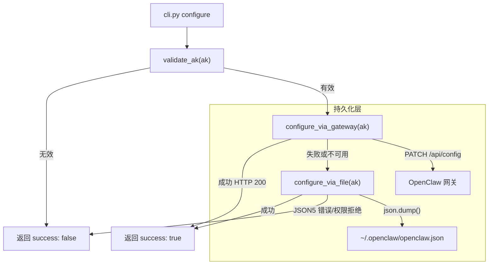
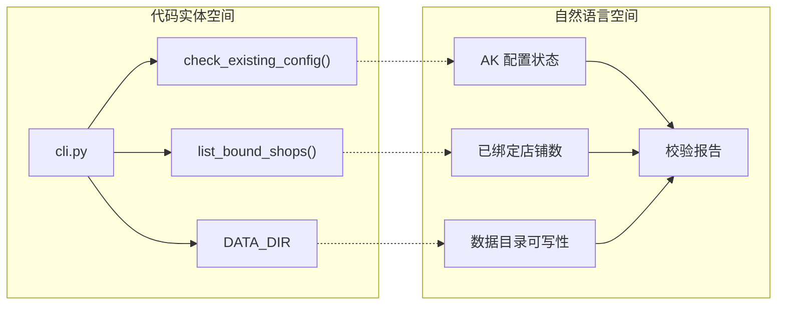

# 入门与安装

<details>
<summary>相关源文件</summary>

以下文件曾作为生成本 wiki 页面的上下文：

- [README.md](../README.md)
- [references/configure.md](../references/configure.md)
- [scripts/configure.py](../scripts/configure.py)

</details>

本页提供 `1688-shopkeeper` 技能的技术安装指南，涵盖通过 OpenClaw 安装、获取鉴权凭证，以及用于持久化访问密钥（AK）的配置流程。

## 安装

技能设计在 **OpenClaw** 环境中运行。在 OpenClaw 界面中使用下列命令安装：

```text
Please help me install this skill: https://github.com/raosirui/1688-skill.git
```

## 获取 ALI_1688_AK

技能需要访问密钥（AK）以对 1688 AI Next API 鉴权。该密钥作为访问商品搜索与分发服务的身份凭证。

### 获取步骤

1. 下载并打开 **1688 AI 版 APP**。
2. 进入首页，选择 **「一键部署开店Claw，全自动化赚钱🦞」** 入口。
3. 复制提供的 **AK（Access Key）**。

### AK 规范

AK 为字符串，须满足：

*   **长度：** 至少 32 个字符。
*   **允许字符：** `A-Z`、`a-z`、`0-9`、`_`、`-`、`=`。
*   **内部结构：** 前 32 字节为 `Secret`，其余部分为 `Key ID`。

## 配置流程

配置由 `scripts/configure.py` 处理，采用双层持久化策略，在避免破坏 OpenClaw 配置文件的前提下安全保存 AK。

### 数据流：AK 持久化

下图说明 `configure` 命令如何尝试写入 AK，并优先使用 OpenClaw 网关 API，而非直接改文件。

**示意图：AK 配置逻辑**



### 实现要点

1.  **网关 API（`configure_via_gateway`）：** 首选方式。向 OpenClaw 网关（`http://localhost:18789`）发送 `PATCH` 请求。由网关维护 `openclaw.json`，可避免 JSON5 注释或格式问题。
2.  **文件回退（`configure_via_file`）：** 网关不可用时，脚本尝试手动解析并更新 `~/.openclaw/openclaw.json`。若检测到非标准 JSON（如 JSON5），会中止以免数据损坏。
3.  **即时生效：** 修改配置文件后常需重启网关才能全局生效，CLI 建议在立即执行的命令前加上环境变量前缀 `ALI_1688_AK=<AK>`。

## 校验

配置完成后，应使用 `check` 命令验证环境。

### 校验命令

```bash
python3 cli.py check
```

### 系统状态映射

`check` 命令聚合多处内部状态，生成健康报告。

**示意图：check 命令数据聚合**



### 输出结构

校验输出遵循标准 JSON 响应格式：

| 字段 | 说明 |
| :--- | :--- |
| `success` | 布尔值，表示环境是否就绪。 |
| `markdown` | 人类可读状态（例如「✅ AK 已配置」「⚠️ 0 个店铺已绑定」）。 |
| `data` | 对象，含 `configured`（布尔）与 `shop_count`（整数）。 |
