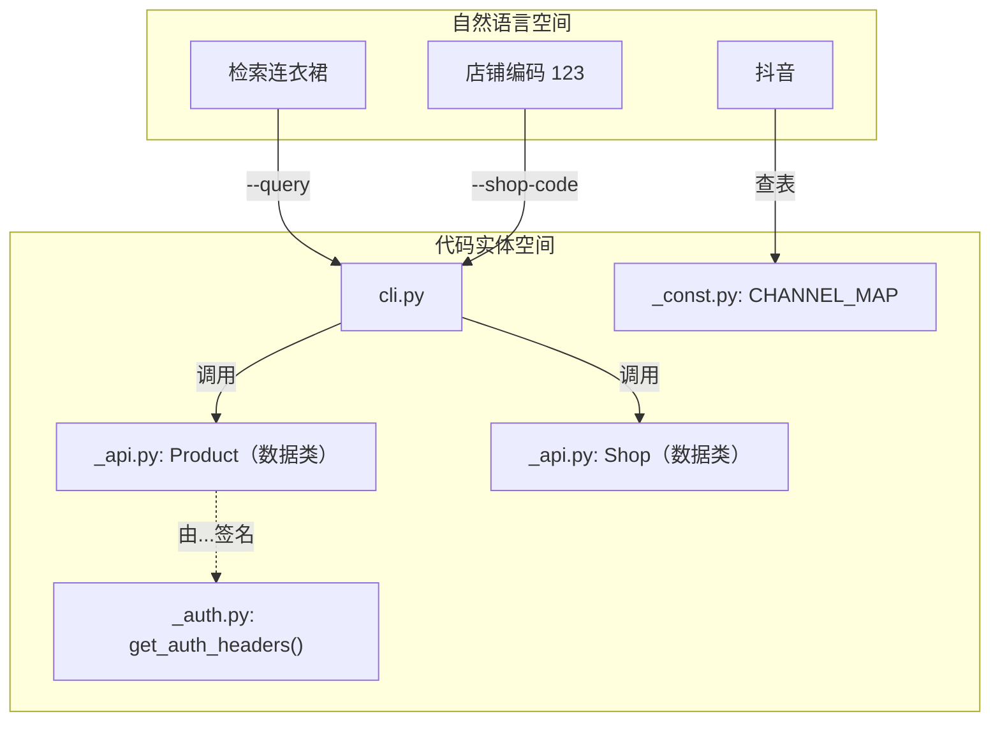
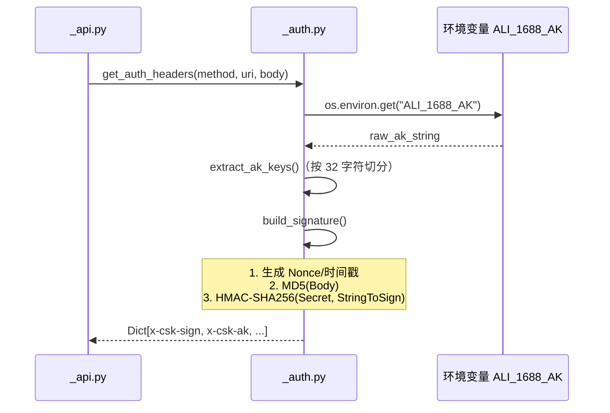

# 术语表

相关源文件

以下文件曾作为生成本 wiki 页面的上下文：

- [SKILL.md](../SKILL.md)
- [references/configure.md](../references/configure.md)
- [references/faq/listing-template.md](../references/faq/listing-template.md)
- [references/faq/platform-selection.md](../references/faq/platform-selection.md)
- [references/faq/product-selection.md](../references/faq/product-selection.md)
- [references/search.md](../references/search.md)
- [scripts/_api.py](../scripts/_api.py)
- [scripts/_auth.py](../scripts/_auth.py)
- [scripts/_const.py](../scripts/_const.py)
- [scripts/publish.py](../scripts/publish.py)

本页提供 `1688-shopkeeper` 技能中使用的技术术语、中文电商领域行话与代码库实体的综合参考，用于衔接业务逻辑与实现细节，便于工程师上手。

## 1. 核心系统实体

系统将自然语言意图映射为结构化 API 调用与本地数据持久化。

### 访问密钥（AK）

从 **1688 AI 版 App** 获取的主要鉴权凭证。其为组合字符串：前 32 个字符表示 `access_key_secret`，其余部分表示 `access_key_id`。通常保存在环境变量 `ALI_1688_AK` 中。

### 数据 ID（`data_id`）

在搜索操作中生成的、基于时间戳的唯一标识（例如 `20240101_120000`）。用于将搜索结果以 JSON 文件形式持久化到 `DATA_DIR`，使 `publish` 命令可引用某次搜索批次而无需再次请求 API。

### 渠道（`channel`）

商品分发所至的下游电商平台。系统使用 `CHANNEL_MAP` 将用户输入（例如「抖店」「taobao」）规范为 API 可用的标识符。

| 代码标识 | 常用名称 | API 取值 |
| :--- | :--- | :--- |
| `douyin` | 抖音 / 抖店 | `douyin` |
| `pinduoduo` | 拼多多 | `pinduoduo` |
| `xiaohongshu` | 小红书 | `xiaohongshu` |
| `thyny` | 淘宝 | `thyny` |

---

## 2. 技术实现示意图

### 实体关系：自然语言到代码

下图说明用户概念如何映射到代码库中的具体 Python 类与常量。

### 鉴权与签名流程

系统对所有发往 `ainext.1688.com` 的请求使用 HMAC-SHA256 签名。

---

## 3. 领域行话（中文电商）

| 术语 | 技术语境 | 实现说明 |
| :--- | :--- | :--- |
| **铺货（发布/分发）** | 将 1688 商品上架到下游店铺（如抖音）的行为。 | 由 `_api.py` 中的 `publish_items` 处理。 |
| **一件代发** | 由 1688 供应商直接向终端客户发货的履约模式。 | 通过 `stats.last30DaysDropShippingSales` 等字段筛选。 |
| **揽收率** | 物流在 24 小时内揽收的订单占比。 | 在 `stats` 对象中以 `collectionRate24h` 表示。 |
| **复购率** | 客户再次向同一供应商购买的比率。 | 以 `repurchaseRate` 表示。 |
| **蓝海/红海** | 市场竞争程度。 | 使用 `downstreamOffer`（已有上架数）等计算。 |

---

## 4. 代码库常量与限制

系统施加特定约束以符合 1688 API 要求。

*   **`SEARCH_LIMIT`（20）：** 单次搜索返回商品数量的上限，用于平衡性能与相关性。
*   **`PUBLISH_LIMIT`（20）：** 单次批量发布允许的最大商品数。
*   **`MAX_RETRIES`（3）：** `with_retry` 装饰器在网络请求失败前重试的次数。
*   **`DATA_DIR`：** 基于 `OPENCLAW_WORKSPACE_DIR` 动态解析，默认为 `~/.openclaw/workspace/1688-skill-data/products`。

### 数据模式

#### 商品统计（`stats`）

`Product` 数据类包含 `stats` 字典，其中的关键指标用于 AI 选品逻辑：

*   `last30DaysSales`：近期销量。
*   `goodRates`：质量指标（0.0 至 1.0）。
*   `downstreamOffer`：竞争度（下游已有 offer 数量等）。

#### 发布结果（`PublishResult`）

分发尝试后返回：

*   `success`：整体是否成功。
*   `published_count`：成功上架条数。
*   `failed_items`：包含商品 ID 与具体错误信息的字典列表。
