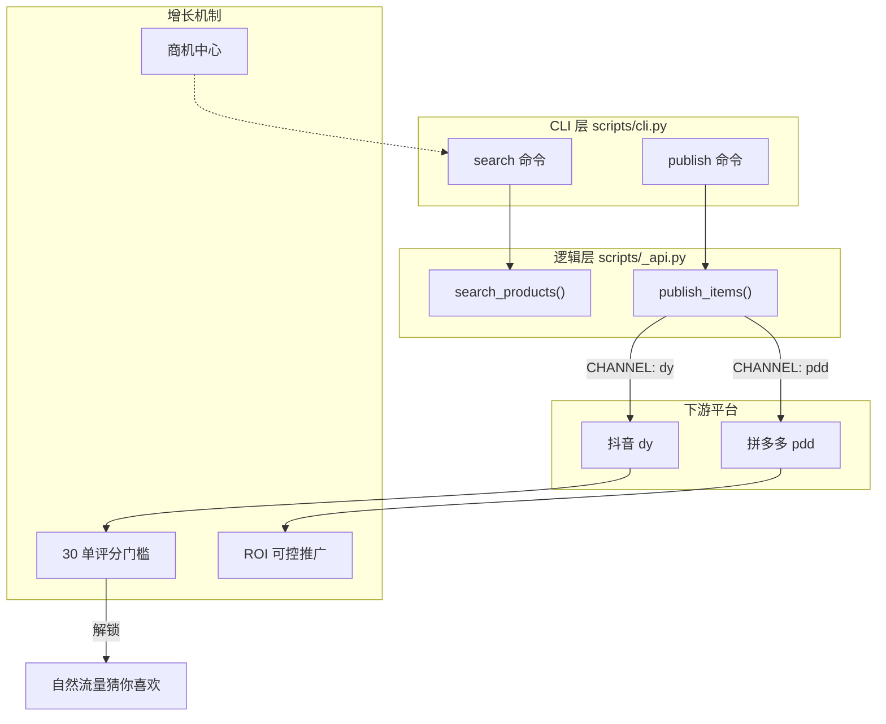

# 新店冷启动指南

相关源文件

以下文件曾作为生成本 wiki 页面的上下文：

- [references/faq/new-store.md](../references/faq/new-store.md)

本指南面向在支持平台（抖音、拼多多、小红书、淘宝）上新开店铺的商家，提供技术与运营策略，侧重突破「零单门槛」、配置支付通道，以及利用各平台商家工具获取初始流量。

## 店铺初始化流程

通过 `cli.py shops` 绑定新店铺后，商家需从「冷启动」阶段过渡到「活跃」阶段。该过渡主要由平台评分门槛与订单量驱动。

### 突破零单门槛（抖音）

对抖音（dy），平台要求至少 **30 笔有效订单** 才会生成商家服务分。该分数是进入「猜你喜欢」推荐池的前提。

| 策略 | 技术/运营落地 |
| :--- | :--- |
| **定价策略** | 在 1688 成本价基础上使用极低加价（例如 +1 元）。 |
| **营销工具** | 在商家后台配置「新人专享」「限时折扣」等。 |
| **类目一致** | 确保「引流款」与主营类目一致，避免 GMV 被错误归类。 |

### 支付通道配置

为降低「拍下未支付」比例，需确保主要支付方式均已开通。`1688-skill` 负责商品分发，最终转化仍依赖这些后台设置。

*   **抖音（dy）：** 须手动同时开通 **支付宝** 与 **微信支付**。
*   **拼多多（pdd）：** 主流支付方式通常默认已开通。

## 流量获取与推广逻辑

系统支持选品与上架，流量则由平台算法与推广资源驱动。

### 拼多多（PDD）推广逻辑

拼多多通过推广红包与「成交后付费」模式，对新店有特定优势。

1.  **推广红包：** 新店通常可获得约 200 元推广券，应用于测款与首单转化。
2.  **ROI 控制：** 与抖音高波动的「放量模式」不同，拼多多支持目标 ROI 控制，更适合利润空间紧、经验少的商家。

### 商机中心

抖音与拼多多均提供「商机中心」，用于识别需求高、供给少的商品。

1.  **识别：** 在平台后台寻找与自身 1688 供应链能力匹配的商机。
2.  **映射：** 使用 `cli.py search` 时，侧重标题、类目、属性等与商机要求严格对齐。
3.  **流量倾斜：** 成功映射到商机的商品会获得平台的流量优先扶持。

## 数据流：从搜索到店铺激活

下图说明 `1688-skill` 命令如何与各平台增长机制交互。

### 系统交互示意图

## 运营检查清单

### 新店里程碑

建议监控以下指标，确保店铺走出「冷启动」：

*   **订单量：** 达到 30 笔有效订单以触发服务分。
*   **响应时效：** 保持高响应率，以满足流量分配资格。
*   **纠纷率：** 关注 30 日纠纷率，过高会限流。
*   **GMV 任务：** 完成平台任务（如 500/2000/5000 元 GMV 目标）以解锁更高阶商家权益。

### 技术实体映射

下表将本指南中的业务概念映射到代码库中的技术实体。

| 业务概念 | 代码实体 / 常量 | 实现说明 |
| :--- | :--- | :--- |
| **目标平台** | `CHANNEL_MAP` | 定义 `dy`、`pdd`、`xhs`、`thyny` 等映射。 |
| **选品** | `search_products` | 按商机中心趋势等条件拉取商品。 |
| **批量分发** | `PUBLISH_LIMIT` | 单次发布限制为 20 条，以控制质量。 |
| **状态校验** | `check_status` | 运营前校验 `ALI_1688_AK` 是否有效。 |
