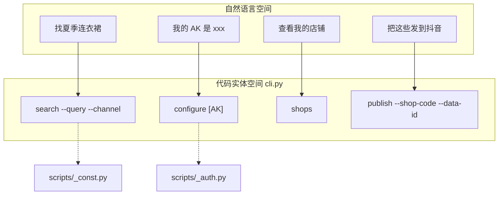
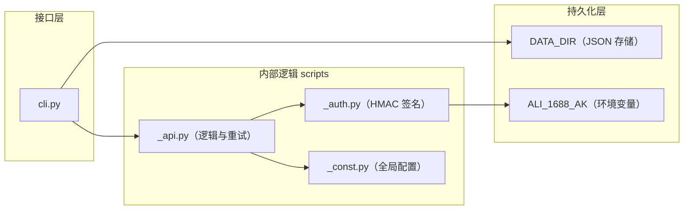

# 总览

相关源文件

以下文件曾作为生成本 wiki 页面的上下文：

- [README.md](../README.md)
- [SKILL.md](../SKILL.md)
- [scripts/_const.py](../scripts/_const.py)

`1688-shopkeeper` 技能是面向 1688 选品与分发的专用工具。用户可在 1688 检索优质商品、分析商品指标，并将商品「发布」（分发）到抖音、拼多多、小红书、淘宝等下游电商平台。

系统设计在 **OpenClaw** 环境中运行，既提供面向智能体的 CLI，也提供结构化参考资料，以支撑智能体在电商运营场景下的决策。

### 核心能力

*   **选品**：按查询词与目标渠道自动检索、筛选 1688 商品。
*   **店铺管理**：跟踪下游店铺的授权状态与绑定信息。
*   **一键铺货**：将所选商品批量发布到多个平台。
*   **知识库**：内置 FAQ 与运营指南，覆盖定价、物流与合规等主题。

### 系统入口与流程

通过统一的 Python 入口访问：`python3 {baseDir}/cli.py <command> [options]`。

标准操作流程从配置到分发按逻辑顺序展开：

1.  **检查/配置**：确认已设置 `ALI_1688_AK`（访问密钥）。
2.  **搜索**：查询商品并获取带推荐分的结构化数据。
3.  **店铺**：确认哪些下游店铺已授权且可上架。
4.  **发布**：将所选商品分发到指定店铺。

#### 示意图：自然语言到 CLI 命令的映射

下图展示用户意图（自然语言空间）如何映射到具体代码执行路径（代码实体空间）。

---

### 支持平台

技能支持四个主要下游渠道。用户可使用自然语言别名，系统会将其映射为 `CHANNEL_MAP` 中定义的内部标识。

| 平台 | 内部渠道键 | 自然语言别名 |
| :--- | :--- | :--- |
| **抖音** | `douyin` | 抖音, 抖店 |
| **拼多多** | `pinduoduo` | 拼多多 |
| **小红书** | `xiaohongshu` | 小红书 |
| **淘宝** | `thyny` | 淘宝 |

平台相关行为与映射逻辑的更多说明见 [支持平台与渠道映射](supported-platforms.md)。

---

### 组件架构

代码库分为 CLI 层、业务逻辑层，以及负责鉴权与常量的工具层。

#### 示意图：系统组件交互

下图说明 CLI 入口、内部模块与持久化层之间的关系。

### 安装与配置

在执行任何操作前，须从 **1688 AI 版 APP** 获取并配置 `ALI_1688_AK`。该密钥作为身份凭证，用于通过 HMAC-SHA256 对请求签名。

分步安装与设置说明见 [入门与安装](getting-started.md)。
