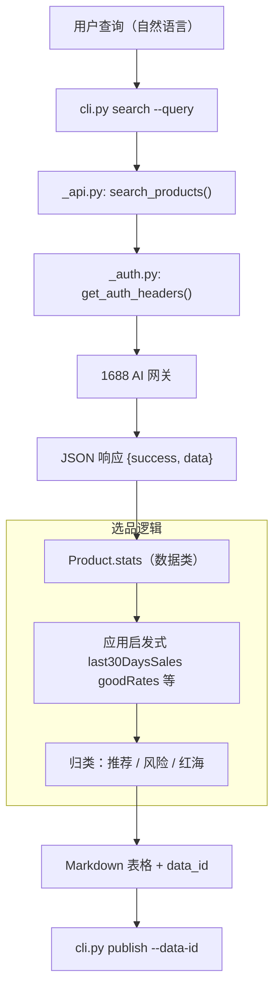
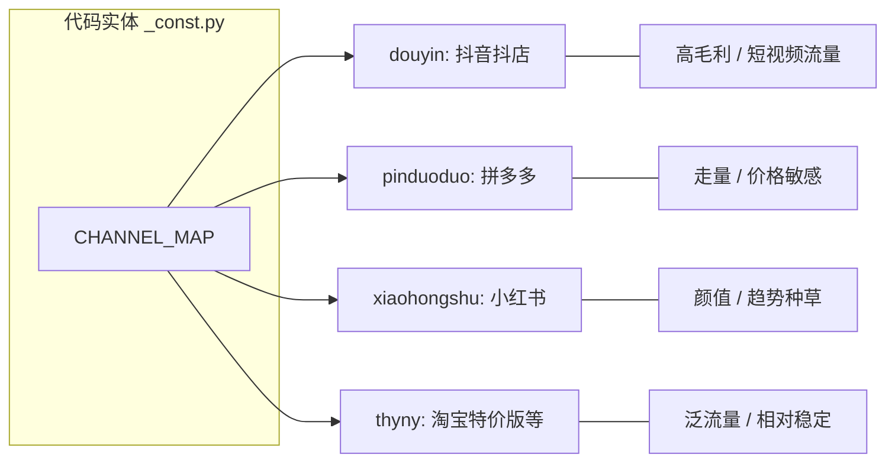
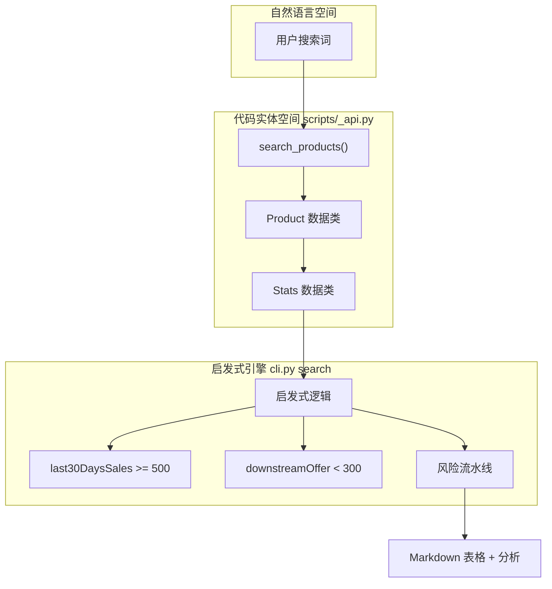
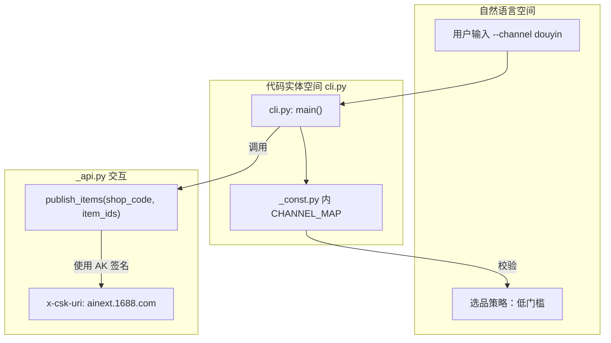
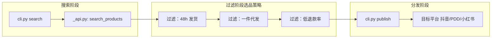

# 选品指南

相关源文件

以下文件曾作为生成本 wiki 页面的上下文：

- [references/FAQ.md](../references/FAQ.md)
- [references/search.md](../references/search.md)
- [references/faq/product-selection.md](../references/faq/product-selection.md)
- [references/faq/platform-selection.md](../references/faq/platform-selection.md)

选品流程是 `1688-skill` 的核心业务逻辑：将自然语言意图转为结构化数据，用统计规则筛出高潜力商品，并为下游零售平台分发做准备。本指南端到端概述选品过程。

## 选品流程总览

选品分为三个阶段：**发现**、**分析**、**决策**。系统通过 `cli.py search` 对接 1688 AI 搜索，返回可读 Markdown 与可机读 JSON。

### 流程图：从查询到选品

下图将自然语言选品请求映射到底层代码实体与数据结构。

## 数据驱动分析

搜索完成后，每个商品会带有 `stats` 对象。Markdown 对用户做了摘要，底层逻辑（及 AI 智能体）需按阈值评估，以降低选品风险。

### 核心评估指标

| 指标 | 代码字段 | 高潜力阈值 | 风险阈值 |
| :--- | :--- | :--- | :--- |
| **近期销量** | `last30DaysSales` | >= 500 | < 100 |
| **品质** | `goodRates` | >= 0.90 | < 0.85 |
| **复购** | `repurchaseRate` | >= 0.10 | - |
| **竞争度** | `downstreamOffer` | < 200（蓝海） | > 500（红海） |
| **物流** | `collectionRate24h` | >= 0.90 | < 0.80 |

这些指标的计算方式与自动化推荐的「五条准则」细则，见下文 **搜索指标与选品启发式**。

## 战略性分发平台选择

选品也需结合目标下游平台。`1688-skill` 支持四大渠道，流量形态与准入要求各不相同。

### 平台映射（CHANNEL_MAP）

系统将内部标识映射到下游零售平台，以适配搜索结果与分发参数。

结合经验与资金如何选平台，见下文 **平台选择策略**。

## 风险缓释

本指南强调「风险优先」。即便销量很高，仍可能因下列原因被标红：

*   **样本不足：** 若 `remarkCnt` < 30，则 `goodRates`、`repurchaseRate` 统计意义不足。
*   **知识产权：** 标题含品牌名或疑似仿品，需人工复核。
*   **质量疑虑：** 单价极低（如非日用品 < 5 元）等异常定价。

---

## 搜索指标与选品启发式

相关源文件

以下文件曾作为生成本 wiki 页面的上下文：

- [references/faq/product-selection.md](../references/faq/product-selection.md)
- [references/search.md](../references/search.md)

本节说明 1688 API 返回的商品指标数据结构，以及用于评估「是否适合向下游铺货」的启发式逻辑，是理解系统如何区分高潜力「蓝海」与高风险或过度竞争商品的主要参考。

### 数据模式：`stats` 对象

通过 `cli.py search` 搜索时，API 为每个商品返回 `stats`，其中为算法与人工选品提供原始遥测数据。

#### 核心决策字段

这些字段是自动推荐引擎的主要驱动。

| 字段 | 类型 | 说明 | 技术阈值 |
| :--- | :--- | :--- | :--- |
| `last30DaysSales` | `int` | 近 30 天销量。 | 建议：>= 500 |
| `goodRates` | `float` | 好评率（0.0～1.0）。 | 风险：< 0.85 |
| `repurchaseRate` | `float` | 买家二次购买占比。 | 建议：>= 0.10 |
| `downstreamOffer` | `int` | 下游已有上架数（竞争）。 | 蓝海：< 200 |
| `collectionRate24h` | `float` | 24 小时内物流揽收占比。 | 建议：>= 0.90 |

#### 元数据与上下文字段

用于细化风险画像并校验样本量是否足够。

| 字段 | 类型 | 说明 | 用途 |
| :--- | :--- | :--- | :--- |
| `remarkCnt` | `int` | 评价总数。 | 若 < 30，认为 `goodRates` 不可靠。 |
| `last30DaysDropShippingSales` | `int` | 一件代发订单带来的销量。 | 衡量供应商一件代发经验。 |
| `earliestListingTime` | `string` | 首次上架的 ISO 日期。 | 区分爆款新品与滞销老链。 |
| `totalSales` | `int` | 历史累计销量。 | 历史热度基线。 |

---

### 市场分类启发式

系统主要依据 `downstreamOffer` 与 `remarkCnt` 将商品归入三类市场状态。

#### 1. 蓝海

*   **条件：** `downstreamOffer` < 200。
*   **逻辑：** 竞争低，适合新店起量、少打价格战。

#### 2. 红海

*   **条件：** `downstreamOffer` > 500。
*   **逻辑：** 饱和度高；除非其他指标（如 `repurchaseRate`）极强，否则标为高竞争风险。

#### 3. 样本不足

*   **条件：** `remarkCnt` < 30。
*   **逻辑：** `goodRates`、`repurchaseRate` 统计意义弱，系统须附加说明：「基于有限数据的评估」。

---

### 推荐与风险流水线

选品逻辑分两段：**「五条准则」** 用于晋升推荐，**「风险评估」** 用于排除与警示。

#### 五条准则

若以下 **5 条中至少满足 3 条**，则标为 **「建议铺货」**：

1.  `last30DaysSales` >= 500  
2.  `goodRates` >= 0.90  
3.  `repurchaseRate` >= 0.10  
4.  `downstreamOffer` < 300  
5.  `collectionRate24h` >= 0.90  

#### 风险评估流水线

即便进入推荐，仍须过风险过滤；任一项命中须在输出中强制提示。

| 风险类型 | 触发条件 | 系统动作 |
| :--- | :--- | :--- |
| **质量风险** | `goodRates` < 0.85 | 标为「售后风险」。 |
| **数据风险** | `remarkCnt` < 30 | 标为「样本量不足」。 |
| **价格风险** | 单价 < 5 元（非日用品） | 标为「潜在质量/欺诈风险」。 |
| **知产风险** | 标题含品牌名 | 标为「侵权风险」。 |

---

### 技术数据流：从搜索到选品

下图说明原始 API 数据如何在系统内转为可执行的选品启发式。

#### 搜索数据变换

---

### 按类目的选品策略

系统优先「运营复杂度低」的类目，以降低代发商的售后负担。

#### 推荐类目（成功率相对较高）

*   **日用百货：** 家居收纳、厨房小工具等。  
*   **文具：** 学生用品、桌面收纳等。  
*   **婚庆/节庆：** 派对小物、季节装饰等。  

#### 受限类目（高风险）

因退货率高或合规复杂，不建议：

*   **服饰鞋包：** 尺码导致高退货。  
*   **美妆个护：** 监管与过敏风险。  
*   **食品：** 保质期与卫生合规。  
*   **数码电子：** 无品牌货易「与描述不符」纠纷。  

#### 季节性逻辑

启发式建议 **「T-14」**：节假日/活动款宜提前 **7～14 天** 上架，便于 SEO 收录与冷启动流量。

---

## 平台选择策略

相关源文件

以下文件曾作为生成本 wiki 页面的上下文：

- [references/faq/platform-selection.md](../references/faq/platform-selection.md)
- [references/faq/product-selection.md](../references/faq/product-selection.md)

本节比较支持的下游平台：抖音（抖店）、拼多多、小红书、淘宝，从准入门槛、定价灵活度与流量特征给出技术与运营框架，便于选择目标渠道。

### 平台对比总览

`1688-skill` 可向 `CHANNEL_MAP` 中定义的多个渠道铺货。各平台约束与用户行为不同，直接影响一件代发（代发）成败。

| 平台 | 代码（`CHANNEL_MAP`） | 准入门槛 | 定价灵活度 | 流量类型 |
| :--- | :--- | :--- | :--- | :--- |
| **抖音** | `douyin` | 低 | 高（可批量调价） | 兴趣推荐 / 短视频 |
| **拼多多** | `pinduoduo` | 中 | 低（多需手工/受限） | 价格敏感 / 搜索 |
| **小红书** | `xiaohongshu` | 中 | 高 | 内容种草 |
| **淘宝** | `thyny` | 高 | 高 | 成熟 / 搜索为主 |

#### 新手策略建议

对初学者，**抖音（抖店）** 更适合作为第一站：定价失误的惩罚风险相对较低，且支持运费模板同步与批量改价，便于快速试错。

---

### 分平台详解

#### 1. 抖音（抖店）

门槛低，对一件代发模式相对友好。

*   **技术优势：** 支持批量同步售价、运费模板自动映射，减少手工维护。  
*   **流量特征：** 依赖兴趣算法；无内容时自然流量可能有限，但试错成本较低。  
*   **运营风险：** 合规处罚严，违规可能导致限流或关店。  

#### 2. 拼多多（拼多多）

价敏转化高，但运营负担重。

*   **定价约束：** 在本技能所涉的标准 API 对接语境下，难以灵活批量定价或自动同步运费模板。  
*   **发货风险：** 若未在 1688 核实「分销包邮」等条件，易因包邮预期与实际运费不匹配而亏损。  
*   **受众：** 极度价格敏感；有价格优势时新店可快速起量。  

#### 3. 小红书（小红书）

内容驱动，颜值与「种草」潜力关键。

*   **流量来源：** 纯内容驱动；若无优质笔记/视频，即便商品页「优化」也可能几乎无转化。  
*   **品类契合：** 更适合高颜值、小众品类。  

#### 4. 淘宝（淘宝 / thyny）

生态最成熟，准入要求最高。

*   **现状：** 内部管控严，新发代发账号门槛高。  
*   **长期价值：** 跨过初期门槛后，更适合长期品牌化经营。  

---

### 技术映射：逻辑到平台

下图说明 `cli.py` 如何将用户所选渠道派发到 `_api.py` 请求及平台相关逻辑。

#### 渠道派发流程

---

### 类目与风险选择策略

无论目标平台为何，`1688-skill` 所支持的自动代发流程都更偏好特定类目。

#### 推荐类目（低复杂度）

*   **百货：** 日用品、家居收纳。  
*   **文具：** 学生用品、办公整理。  
*   **婚庆/节庆：** 季节需求明确、售后相对简单。  

#### 高风险类目（宜避开）

*   **服饰/美妆：** 尺码、肤质导致高退货。  
*   **低价高预期：** 如 10 元水壶、3 元饰品等，易引发「仅退款」纠纷。  

#### 运营数据流

### 实施小结

落地选品策略时，`cli.py` 通过 `--channel` 参数落实上述选择。

1.  **搜索：** 针对目标平台在 1688 侧搜索，以获得更相关的统计字段。  
2.  **校验：** 用 `cli.py shops` 查看该渠道的绑定店铺。  
3.  **执行：** 向选定平台发布，并遵守单次请求 `PUBLISH_LIMIT` 为 20 条，以保持稳定性。  
