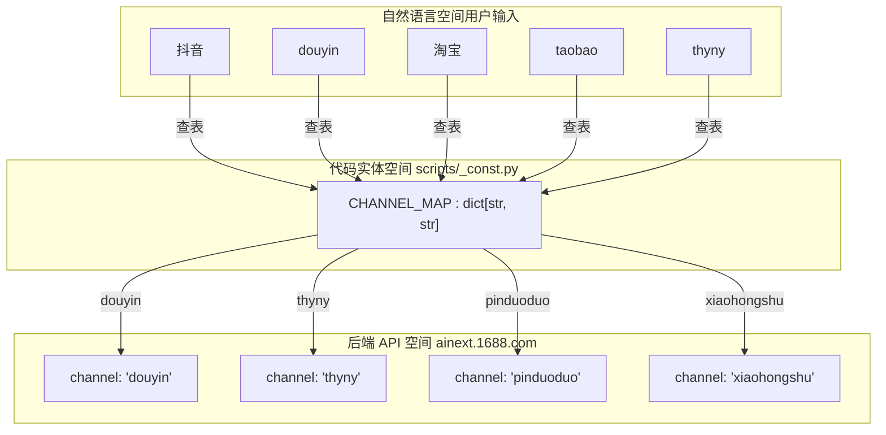
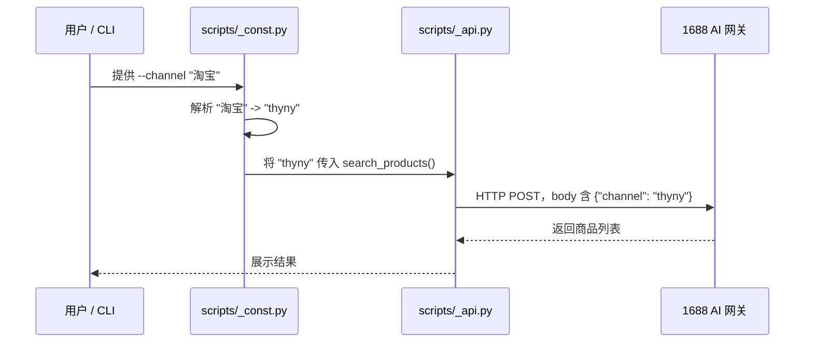

# 支持平台与渠道映射

相关源文件

以下文件曾作为生成本 wiki 页面的上下文：

- [SKILL.md](../SKILL.md)
- [references/publish.md](../references/publish.md)
- [scripts/_const.py](../scripts/_const.py)

本页说明 1688-shopkeeper 技能支持的下游平台、平台标识的内部映射，以及如何将用户提供的别名解析为 API 可用的渠道字符串。

## 支持平台概览

1688-shopkeeper 技能支持从 1688.com 选品并分发到四个主要零售平台。用户可能用不同名称指代同一平台（例如「Douyin」与「TikTok 中国」、「Taobao」与 `thyny`），系统通过集中映射保证与 API 通信时标识一致。

| 平台 | CLI/API 内部名称 | 常用别名 |
| :--- | :--- | :--- |
| **抖音** | `douyin` | 抖音, 抖店 |
| **拼多多** | `pinduoduo` | 拼多多 |
| **小红书** | `xiaohongshu` | 小红书 |
| **淘宝** | `thyny` | 淘宝, taobao |

---

## CHANNEL_MAP 常量

`scripts/_const.py` 中的 `CHANNEL_MAP` 字典是平台识别的**唯一权威来源**。它将英文标准名与中文自然语言别名映射为 1688 AI 后端要求的字符串。

### 自然语言到代码实体的映射

下图说明各类输入字符串如何解析为内部 `CHANNEL_MAP` 键，并最终成为 `_api.py` 调用中使用的后端取值。

**示意图：渠道解析流程**

---

## 实现细节

### 渠道解析逻辑

执行 `cli.py search` 等命令时，`--channel` 参数会对照 `CHANNEL_MAP` 的键进行校验。若未指定渠道，系统回退到 `DEFAULT_CHANNEL`。

*   **默认平台**：用户未指定目标时，默认使用 `douyin`。
*   **淘宝特例**：用户常说「taobao」，但 1688 API 将该下游渠道标识为 `thyny`。`CHANNEL_MAP` 会透明完成该转换。

### 数据流：CLI 到 API

解析后的渠道字符串经业务逻辑层传入 `_api.py`，由该模块构造发往 1688 AI 网关的最终请求体。

**示意图：平台数据流**

---

## 运营约束

平台选择会影响多项下游行为与限制：

1.  **发布上限**：无论平台为何，单次请求的 `PUBLISH_LIMIT` 严格为 20 条商品，以符合 1688 API 限制。
2.  **授权状态**：平台连接需定期刷新。`cli.py shops` 对每个绑定店铺返回 `is_authorized`。若抖音或拼多多店铺显示 `is_authorized: false`，用户需通过 1688 AI 版 App 重新授权。
3.  **搜索过滤**：`search` 命令会按渠道优化结果，以满足对应平台的业务要求（例如按一件代发兼容性等过滤）。
